# AWS Cloud Practitioner Essentials

# Module 1: Introduction to Amazon Web Services

## What is Cloud Computing?

Cloud computing is the on-demand delivery of IT resources over the Internet with pay-as-you-go pricing. On-demand delivery indicates AWS has the resources you need when you need them.

La computación en la nube es la entrega bajo demanda de recursos de TI a través de Internet con precios de pago por uso.

Flexibilidad en los recursos. ¿Por qué pagar por entornos de desarrollador, por ejemplo, los fines de semana si sus desarrolladores no trabajan los fines de semana?

Suddenly you find yourself needing 300 virtual servers. Well, just a few clicks and launch them. Or you need 2,000 terabytes of storage; you don't have to tell us in advance, just start using the storage you need when you need it. Don't need them anymore, just as quickly you can return them and stop paying immediately. 

That flexibility is just not possible when you're managing your own data centers. 

At AWS, we call that the undifferentiated, heavy lifting of IT. Tasks that are common, often repetitive, and ultimately time-consuming. These are the tasks AWS wants to help you with so you can focus on what makes you unique. 

pay-as-you-go pricing

## What is a Client-Server Model?

En informática, un cliente puede ser un navegador web o una aplicación de escritorio con la que una persona interactúa para realizar solicitudes a los servidores de la computadora. Un servidor puede ser servicios como Amazon Elastic Compute Cloud (Amazon EC2), un tipo de servidor virtual.

Por ejemplo, supongamos que un cliente solicita una noticia, la puntuación de un juego online o un vídeo divertido. El servidor evalúa los detalles de esta solicitud y la cumple devolviendo la información al cliente.

## Deployment Models for Cloud Computing

The AWS Cloud offers three cloud computing deployment models are cloud-based, on-premises, and hybrid. 

**Cloud-based Deployment**

- Run all parts of the application in the cloud.
- Migrate existing applications to the cloud.
- Design and build new applications in the cloud.

**On-premises Deployment**

- Deploy resources by using virtualization and resource management tools.
- Increase resource utilization by using application management and virtualization technologies.

On-premises deployment is also known as a private cloud deployment. In this model, resources are deployed on premises by using virtualization and resource management tools.

For example, you might have applications that run on technology that is fully kept in your on-premises data center. Though this model is much like legacy IT infrastructure, its incorporation of application management and virtualization technologies helps to increase resource utilization.

**Hybrid Deployment**

- Connect cloud-based resources to on-premises infrastructure.
- Integrate cloud-based resources with legacy IT applications.

In a hybrid deployment, cloud-based resources are connected to on-premises infrastructure. You might want to use this approach in a number of situations. For example, you have legacy applications that are better maintained on premises, or government regulations require your business to keep certain records on premises.

For example, suppose that a company wants to use cloud services that can automate batch data processing and analytics. However, the company has several legacy applications that are more suitable on premises and will not be migrated to the cloud. With a hybrid deployment, the company would be able to keep the legacy applications on premises while benefiting from the data and analytics services that run in the cloud.

## Benefits of Cloud Computing

**Trade upfront expense for variable expense**

Upfront expense refers to data centers, physical servers, and other resources that you would need to invest in before using them. Variable expense means you only pay for computing resources you consume instead of investing heavily in data centers and servers before you know how you’re going to use them.

By taking a cloud computing approach that offers the benefit of variable expense, companies can implement innovative solutions while saving on costs.

**Stop spending money to run and maintain data centers**

Computing in data centers often requires you to spend more money and time managing infrastructure and servers. A benefit of cloud computing is the ability to focus less on these tasks and more on your applications and customers.

**Stop guessing capacity**

With cloud computing, you don’t have to predict how much infrastructure capacity you will need before deploying an application. For example, you can launch Amazon EC2 instances when needed, and pay only for the compute time you use. Instead of paying for unused resources or having to deal with limited capacity, you can access only the capacity that you need. You can also scale in or scale out in response to demand.

**Benefit from massive economies of scale**

By using cloud computing, you can achieve a lower variable cost than you can get on your own. Because usage from hundreds of thousands of customers can aggregate in the cloud, providers, such as AWS, can achieve higher economies of scale. The economy of scale translates into lower pay-as-you-go prices. 

**Increase speed and agility**

The flexibility of cloud computing makes it easier for you to develop and deploy applications.

This flexibility provides you with more time to experiment and innovate. When computing in data centers, it may take weeks to obtain new resources that you need. By comparison, cloud computing enables you to access new resources within minutes.

**Go global in minutes**

The global footprint of the AWS Cloud enables you to deploy applications to customers around the world quickly, while providing them with low latency. This means that even if you are located in a different part of the world than your customers, customers are able to access your applications with minimal delays. 

Later in this course, you will explore the AWS global infrastructure in greater detail. You will examine some of the services that you can use to deliver content to customers around the world.

## Module 1 Discussion
We hope you found this week’s content informative and insightful. Head over to the discussion forums to discuss this week’s topics with your classmates by clicking here. 

Remember, if you have certain questions/comments, they are best addressed in the appropriate forums like:

1. [Instructor Q&A forum](https://www.coursera.org/learn/aws-cloud-practitioner-essentials/discussions/forums/LZjW4LH_EeuIiBKFEoYNBQ?utm_medium=institutions&utm_source=aws&utm_campaign=aws-forum-prompt-may2021)

2. [Community forum](https://www.coursera.org/learn/aws-cloud-practitioner-essentials/discussions/forums/LsAY-7H_Eeu_oA4qwEAzDw?utm_medium=institutions&utm_source=aws&utm_campaign=aws-forum-prompt-may2021)

3. [AWS Technical Topics forum](https://www.coursera.org/learn/aws-cloud-practitioner-essentials/discussions/forums/MmBxPrH_Eeu_oA4qwEAzDw?utm_medium=institutions&utm_source=aws&utm_campaign=aws-forum-prompt-may2021)

## Resources
To learn more about the concepts that were explored in Module 1, review these resources.

- [AWS glossary](https://docs.aws.amazon.com/general/latest/gr/glos-chap.html)
- [Whitepaper: Overview of Amazon Web Services](https://d0.awsstatic.com/whitepapers/aws-overview.pdf)
- [AWS Fundamentals: Overview](https://aws.amazon.com/getting-started/fundamentals-overview/)
- [What is cloud computing?](https://aws.amazon.com/es/what-is-cloud-computing/)
- [Types of cloud computing](https://aws.amazon.com/es/types-of-cloud-computing/)
- [Cloud computing with AWS](https://aws.amazon.com/es/what-is-aws/)

# Module 2: Compute in the Cloud

## Amazon Elastic Compute Cloud (Amazon EC2)

[Amazon Elastic Compute Cloud (Amazon EC2)](https://aws.amazon.com/es/ec2/)

Imagine que usted es responsable de la arquitectura de los recursos de su empresa y necesita soportar nuevos sitios web. Con los recursos locales tradicionales, debe hacer lo siguiente:

- Gaste dinero por adelantado para comprar hardware.
- Espere a que se le entreguen los servidores.
- Instale los servidores en su centro de datos físico.
- Realice todas las configuraciones necesarias.

En comparación, con una instancia Amazon EC2 puede utilizar un servidor virtual para ejecutar aplicaciones en la nube de AWS.

- Puede aprovisionar y lanzar una instancia Amazon EC2 en cuestión de minutos.
- Puede dejar de usarlo cuando haya terminado de ejecutar una carga de trabajo.
- Solo paga por el tiempo de proceso que utiliza cuando se ejecuta una instancia, no cuando se detiene o finaliza.
- Puede ahorrar costos pagando solo por la capacidad del servidor que necesita o desea.

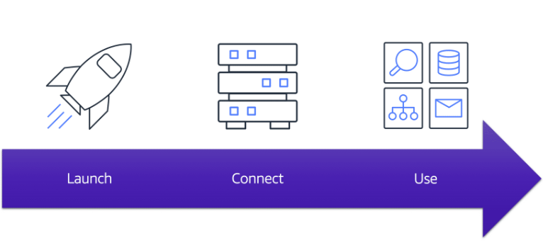

**Launch**

En primer lugar, se lanza una instancia. Comience seleccionando una plantilla con configuraciones básicas para su instancia. Estas configuraciones incluyen el sistema operativo, el servidor de aplicaciones o las aplicaciones. También seleccione el tipo de instancia, que es la configuración de hardware específica de la instancia. 

A medida que se prepara para lanzar una instancia, especifique la configuración de seguridad para controlar el tráfico de red que puede fluir dentro y fuera de la instancia. Más adelante en este curso, exploraremos las características de seguridad de Amazon EC2 con mayor detalle.

**Connect**

A continuación, conéctese a la instancia. Puede conectarse a la instancia de varias maneras. Sus programas y aplicaciones tienen varios métodos diferentes para conectarse directamente a la instancia e intercambiar datos. Los usuarios también pueden conectarse a la instancia iniciando sesión y accediendo al escritorio del equipo.

**Use**

Una vez que se haya conectado a la instancia, puede comenzar a usarla. Puede ejecutar comandos para instalar software, agregar almacenamiento, copiar y organizar archivos, y más.

## Tipos de instancias Amazon EC2

[Amazon EC2 instance types](https://aws.amazon.com/es/ec2/instance-types/)

**General purpose instances**

**Las instancias de uso general** proporcionan un equilibrio de recursos informáticos, de memoria y de red. Puede usarlos para una variedad de cargas de trabajo, tales como:

- servidores de aplicaciones
- servidores de juegos
- servidores back-end para aplicaciones empresariales
- bases de datos pequeñas y medianas

Supongamos que tiene una aplicación en la que las necesidades de recursos para computación, memoria y redes son aproximadamente equivalentes. Puede considerar ejecutarlo en una instancia de uso general porque la aplicación no requiere optimización en ninguna área de recursos individual.

**Compute optimized instances**

**Las instancias optimizadas para cómputo** son ideales para aplicaciones enlazadas a cómputo que se benefician de procesadores de alto rendimiento. Al igual que las instancias de uso general, puede usar instancias optimizadas para computación para cargas de trabajo como servidores web, de aplicaciones y de juegos.

Sin embargo, la diferencia es que las aplicaciones optimizadas para computación son ideales para servidores web de alto rendimiento, servidores de aplicaciones de computación intensiva y servidores de juegos dedicados. También puede utilizar instancias optimizadas para proceso para cargas de trabajo de procesamiento por lotes que requieren procesar muchas transacciones en un solo grupo.

**Memory optimized instances**

**Las instancias optimizadas para memoria están diseñadas** para ofrecer un rendimiento rápido para las cargas de trabajo que procesan grandes conjuntos de datos en memoria. En informática, la memoria es un área de almacenamiento temporal. Contiene todos los datos e instrucciones que una unidad central de procesamiento (CPU) necesita para poder completar acciones. Antes de que un programa o aplicación de computadora pueda ejecutarse, se carga desde el almacenamiento en la memoria. Este proceso de precarga le da a la CPU acceso directo al programa informático.

Supongamos que tiene una carga de trabajo que requiere que se carguen previamente grandes cantidades de datos antes de ejecutar una aplicación. Este escenario puede ser una base de datos de alto rendimiento o una carga de trabajo que implica realizar el procesamiento en tiempo real de una gran cantidad de datos no estructurados. En estos tipos de casos de uso, considere la posibilidad de usar una instancia optimizada para memoria. Las instancias optimizadas para memoria le permiten ejecutar cargas de trabajo con altas necesidades de memoria y recibir un gran rendimiento.

**Accelerated computing instances**

**Las instancias de computación acelerada** utilizan aceleradores de hardware, o coprocesadores, para realizar algunas funciones de manera más eficiente de lo que es posible en el software que se ejecuta en cpu. Ejemplos de estas funciones incluyen cálculos de números de coma flotante, procesamiento de gráficos y coincidencia de patrones de datos.

En informática, un acelerador de hardware es un componente que puede acelerar el procesamiento de datos. Las instancias de computación acelerada son ideales para cargas de trabajo como aplicaciones gráficas, transmisión de juegos y transmisión de aplicaciones.

**Storage optimized instances**

**Las instancias optimizadas para almacenamiento** están diseñadas para cargas de trabajo que requieren un acceso de lectura y escritura secuencial alto a grandes conjuntos de datos en el almacenamiento local. Entre los ejemplos de cargas de trabajo adecuadas para instancias optimizadas para almacenamiento de información se incluyen sistemas de archivos distribuidos, aplicaciones de almacenamiento de datos y sistemas de procesamiento de transacciones en línea (OLTP) de alta frecuencia.

En informática, el término operaciones de entrada/salida por segundo (IOPS) es una métrica que mide el rendimiento de un dispositivo de almacenamiento. Indica cuántas operaciones de entrada o salida diferentes puede realizar un dispositivo en un segundo. Las instancias optimizadas para almacenamiento están diseñadas para ofrecer decenas de miles de IOPS aleatorias de baja latencia a las aplicaciones. 

Puede pensar en las operaciones de entrada como datos colocados en un sistema, como registros ingresados en una base de datos. Una operación de salida son datos generados por un servidor. Un ejemplo de resultado podría ser el análisis realizado en los registros de una base de datos. Si tiene una aplicación que tiene un alto requisito de IOPS, una instancia optimizada para almacenamiento puede proporcionar un mejor rendimiento en comparación con otros tipos de instancia no optimizados para este tipo de caso de uso.

## Precios de Amazon EC2

Con Amazon EC2, solo paga por el tiempo de cómputo que utiliza. Amazon EC2 ofrece una variedad de opciones de precios para diferentes casos de uso. Por ejemplo, si su caso de uso puede soportar interrupciones, puede ahorrar con Instancias de spot. También puede ahorrar confirmando antes y bloqueando un nivel mínimo de uso con instancias reservadas.

**Bajo demanda**

**Las instancias bajo demanda** son ideales para cargas de trabajo irregulares a corto plazo que no se pueden interrumpir. No se aplican costos iniciales ni contratos mínimos. Las instancias se ejecutan continuamente hasta que las detiene y solo paga por el tiempo de proceso que usa. 

Los casos de uso de ejemplo para instancias bajo demanda incluyen el desarrollo y la prueba de aplicaciones y la ejecución de aplicaciones que tienen patrones de uso impredecibles. Las instancias bajo demanda no se recomiendan para cargas de trabajo que duran un año o más, ya que estas cargas de trabajo pueden experimentar mayores ahorros de costos con las instancias reservadas.

**Planes de ahorro de Amazon EC2**

AWS ofrece planes de ahorro para varios servicios informáticos, incluido Amazon EC2. **Los planes de ahorro de Amazon EC2** le permiten reducir los costos informáticos al comprometerse con una cantidad constante de uso informático durante un período de 1 o 3 años. Este compromiso a plazo se traduce en un ahorro de hasta el 72% sobre los costes On-Demand.

Cualquier uso hasta el compromiso se cobra a la tarifa del Plan de Ahorros con descuento (por ejemplo, $ 10 por hora). Cualquier uso más allá del compromiso se cobra a tarifas regulares bajo demanda.

Más adelante en este curso, revisará AWS Cost Explorer, una herramienta que le permite visualizar, comprender y administrar sus costos y uso de AWS a lo largo del tiempo. Si está considerando sus opciones para planes de ahorro, AWS Cost Explorer puede analizar su uso de Amazon EC2 en los últimos 7, 30 o 60 días. AWS Cost Explorer también proporciona recomendaciones personalizadas para planes de ahorro. Estas recomendaciones estiman cuánto podría ahorrar en sus costos mensuales de Amazon EC2, en función del uso anterior de Amazon EC2 y el monto del compromiso por hora en un plan de ahorro de 1 año o 3 años.

**Instancias reservadas**

**Las instancias reservadas** aon un descuento de facturación aplicado al uso de instancias bajo demanda en su cuenta. Puede comprar instancias reservadas estándar y convertibles por un período de 1 o 3 años, e instancias reservadas programadas por un período de 1 año. Usted obtiene un mayor ahorro de costos con la opción de 3 años.

Al final de un período de instancia reservada, puede seguir utilizando la instancia Amazon EC2 sin interrupción. Sin embargo, se le cobrarán tarifas bajo demanda hasta que realice una de las siguientes acciones:

- Finalice la instancia.
- Adquiera una nueva instancia reservada que coincida con los atributos de la instancia (tipo de instancia, región, arrendamiento y plataforma).

**Detectar instancias**

**Las instancias de spot** son ideales para cargas de trabajo con tiempos de inicio y finalización flexibles, o que pueden soportar interrupciones. Las instancias de spot utilizan la capacidad informática de Amazon EC2 no utilizada y le ofrecen ahorros de costes de hasta un 90 % de descuento sobre los precios bajo demanda. 

Supongamos que tiene un trabajo de procesamiento en segundo plano que puede iniciarse y detenerse según sea necesario (como el trabajo de procesamiento de datos para una encuesta de clientes). Desea iniciar y detener el trabajo de procesamiento sin afectar las operaciones generales de su negocio. 

Si realiza una solicitud de spot y la capacidad de Amazon EC2 está disponible, se lanzará la instancia de spot. Sin embargo, si realiza una solicitud de spot y la capacidad de Amazon EC2 no está disponible, la solicitud no se realizará correctamente hasta que la capacidad esté disponible. La capacidad no disponible puede retrasar el inicio del trabajo de procesamiento en segundo plano. Después de lanzar una instancia de spot, si la capacidad ya no está disponible o la demanda de instancias de spot aumenta, es posible que la instancia se interrumpa. Es posible que esto no plantee ningún problema para el trabajo de procesamiento en segundo plano. Sin embargo, en el ejemplo anterior de desarrollo y prueba de aplicaciones, lo más probable es que desee evitar interrupciones inesperadas. Por lo tanto, elija un tipo de instancia EC2 diferente que sea ideal para esas tareas.

**Hosts dedicados**

**Los hosts dedicados** son servidores físicos con capacidad de instancia Amazon EC2 que está totalmente dedicada a su uso.

Puede usar sus licencias de software existentes por socket, por núcleo o por máquina virtual para ayudar a mantener el cumplimiento de las licencias. Puede comprar hosts dedicados bajo demanda y reservas de anfitriones dedicados. De todas las opciones de Amazon EC2 que se cubrieron, los hosts dedicados son los más caros.

## Escalado de Amazon EC2 (parte 1)

**Escalabilidad**

**La escalabilidad** implica comenzar con solo los recursos que necesita y diseñar su arquitectura para responder automáticamente a la demanda cambiante mediante el escalado horizontal o interno. Como resultado, usted paga solo por los recursos que utiliza. No tiene que preocuparse por la falta de capacidad informática para satisfacer las necesidades de sus clientes.

Si quisiera que el proceso de escalado se realizara automáticamente, ¿qué servicio de AWS utilizaría? El servicio de AWS que proporciona esta funcionalidad para las instancias Amazon EC2 es **Amazon EC2 Auto Scaling.**

**Escalado automático de Amazon EC2**

Si ha intentado acceder a un sitio web que no se cargaba y que con frecuencia agotaba el tiempo de espera, es posible que el sitio web haya recibido más solicitudes de las que pudo manejar. Esta situación es similar a esperar en una larga fila en una cafetería, cuando solo hay un barista presente para tomar pedidos de los clientes.

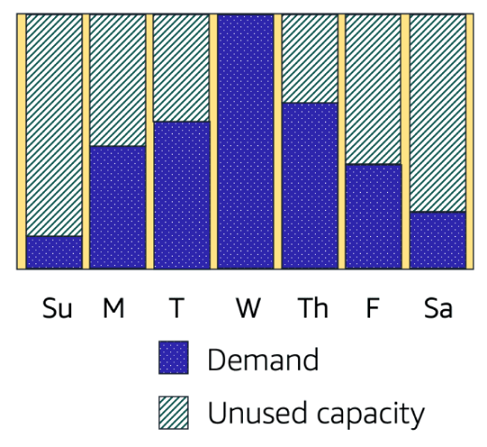

Amazon EC2 Auto Scaling le permite agregar o eliminar automáticamente instancias de Amazon EC2 en respuesta a la cambiante demanda de aplicaciones. Al escalar automáticamente sus instancias dentro y fuera según sea necesario, puede mantener una mayor sensación de disponibilidad de las aplicaciones.

Dentro de Amazon EC2 Auto Scaling, puede utilizar dos enfoques: escalado dinámico y escalado predictivo.

- El escalado dinámico responde a la demanda cambiante. 
- El escalado predictivo programa automáticamente el número correcto de instancias de Amazon EC2 en función de la demanda prevista.

## Escalado de Amazon EC2 (Part 2)

En la nube, la potencia informática es un recurso programático, por lo que puede adoptar un enfoque más flexible para el tema del escalado. Al agregar Amazon EC2 Auto Scaling a una aplicación, puede agregar nuevas instancias a la aplicación cuando sea necesario y finalizarlas cuando ya no sea necesario.

Supongamos que se está preparando para lanzar una aplicación en instancias Amazon EC2. Al configurar el tamaño del grupo de Auto Scaling, puede establecer el número mínimo de instancias Amazon EC2 en una. Esto significa que, en todo momento, debe haber al menos una instancia Amazon EC2 en ejecución.

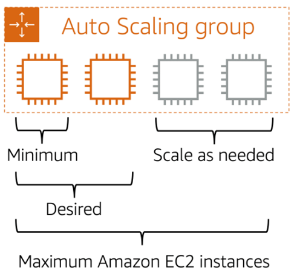

Al crear un grupo de Auto Scaling, puede establecer el número mínimo de instancias Amazon EC2. La **capacidad mínima** es el número de instancias Amazon EC2 que se lanzan inmediatamente después de haber creado el grupo de Auto Scaling. En este ejemplo, el grupo auto scaling tiene una capacidad mínima de una instancia Amazon EC2.

A continuación, puede establecer la **capacidad deseada** en dos instancias Amazon EC2 aunque su aplicación necesite un mínimo de una sola instancia Amazon EC2 para ejecutarse.

**Nota**: Si no especifica el número deseado de instancias de Amazon EC2 en un grupo de Auto Scaling, la capacidad deseada se ajustará de forma predeterminada a su capacidad mínima.

La tercera configuración que puede establecer en un grupo de Auto Scaling es la **capacidad máxima**. Por ejemplo, puede configurar el grupo de Auto Scaling para escalar horizontalmente en respuesta al aumento de la demanda, pero solo a un máximo de cuatro instancias Amazon EC2.

Dado que Amazon EC2 Auto Scaling utiliza instancias Amazon EC2, solo paga por las instancias que utiliza cuando las utiliza. Ahora tiene una arquitectura rentable que proporciona la mejor experiencia al cliente al tiempo que reduce los gastos.

# Equilibrador de carga elástico

**Elastic Load Balancing** es el servicio de AWS que distribuye automáticamente el tráfico entrante de aplicaciones entre varios recursos, como las instancias Amazon EC2. 

Un equilibrador de carga actúa como un único punto de contacto para todo el tráfico web entrante al grupo de Auto Scaling. Esto significa que a medida que agrega o elimina instancias Amazon EC2 en respuesta a la cantidad de tráfico entrante, estas solicitudes se enrutan primero al equilibrador de carga. Luego, las solicitudes se extienden a través de múltiples recursos que las manejarán. Por ejemplo, si tiene varias instancias Amazon EC2, Elastic Load Balancing distribuye la carga de trabajo entre las varias instancias para que ninguna instancia tenga que transportar la mayor parte de ella. 

Aunque Elastic Load Balancing y Amazon EC2 Auto Scaling son servicios independientes, trabajan juntos para ayudar a garantizar que las aplicaciones que se ejecutan en Amazon EC2 puedan proporcionar un alto rendimiento y disponibilidad. 

## Ejemplo: Elastic Load Balancing

**Período de baja demanda**

Aquí hay un ejemplo de cómo funciona Elastic Load Balancing. Supongamos que algunos clientes han venido a la cafetería y están listos para hacer sus pedidos. 

Si solo unos pocos registros están abiertos, esto coincide con la demanda de los clientes que necesitan servicio. Es menos probable que la cafetería tenga registros abiertos sin clientes. En este ejemplo, puede pensar en los registros como instancias Amazon EC2.

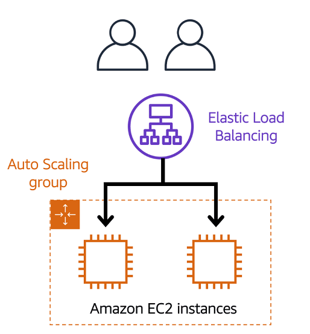

**Período de alta demanda**

A lo largo del día, a medida que aumenta el número de clientes, la cafetería abre más registros para acomodarlos. En el diagrama, el grupo Auto Scaling representa esto.

Además, un empleado de la cafetería dirige a los clientes al registro más apropiado para que el número de solicitudes pueda distribuirse uniformemente a través de los registros abiertos. Puede pensar en este empleado de la cafetería como un equilibrador de carga.

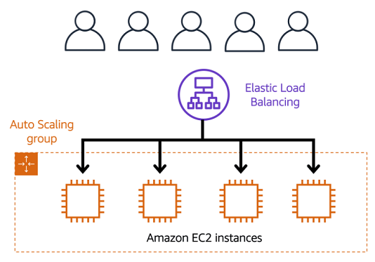

## Aplicaciones monolíticas y microservicios

**Aplicaciones monolíticas**

Las aplicaciones están hechas de múltiples componentes. Los componentes se comunican entre sí para transmitir datos, cumplir con las solicitudes y mantener la aplicación en funcionamiento. 

Supongamos que tiene una aplicación con componentes estrechamente acoplados. Estos componentes pueden incluir bases de datos, servidores, la interfaz de usuario, la lógica empresarial, etc. Este tipo de arquitectura puede considerarse una **aplicación monolítica**. 

En este enfoque de la arquitectura de aplicaciones, si falla un solo componente, fallan otros componentes y, posiblemente, se produce un error en toda la aplicación.

**Microservicios**

Para ayudar a mantener la disponibilidad de las aplicaciones cuando falla un solo componente, puede diseñar la aplicación mediante un enfoque **de microservicios**.

En un enfoque de microservicios, los componentes de la aplicación se acoplan de forma flexible. En este caso, si un solo componente falla, los otros componentes continúan funcionando porque se están comunicando entre sí. El acoplamiento flexible evita que toda la aplicación falle. 

Al diseñar aplicaciones en AWS, puede adoptar un enfoque de microservicios con servicios y componentes que cumplen diferentes funciones. Dos servicios facilitan la integración de aplicaciones: Amazon Simple Notification Service (Amazon SNS) y Amazon Simple Queue Service (Amazon SQS).

## Amazon Simple Notification Service (Amazon SNS)

**Amazon Simple Notification Service (Amazon SNS)** es un servicio de publicación/suscripción. Con temas de Amazon SNS, un editor publica mensajes a los suscriptores. Esto es similar a la cafetería; el cajero proporciona pedidos de café al barista que hace las bebidas.

En Amazon SNS, los suscriptores pueden ser servidores web, direcciones de correo electrónico, funciones de AWS Lambda u otras opciones. 

**Publicación de actualizaciones de un solo tema**

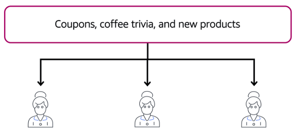

Supongamos que la cafetería tiene un solo boletín que incluye actualizaciones de todas las áreas de su negocio. Incluye temas como cupones, trivia de café y nuevos productos. Todos estos temas se agrupan porque se trata de un único boletín. Todos los clientes que se suscriben al boletín reciben actualizaciones sobre cupones, trivialidades de café y nuevos productos.

Después de un tiempo, algunos clientes expresan que preferirían recibir boletines informativos separados solo para los temas específicos que les interesan. Los propietarios de las cafeterías deciden probar este enfoque.

**Publicación de actualizaciones de varios temas**

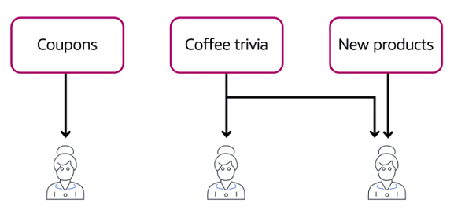

Ahora, en lugar de tener un solo boletín para todos los temas, la cafetería lo ha dividido en tres boletines separados. Cada boletín está dedicado a un tema específico: cupones, trivialidades de café y nuevos productos.

Los suscriptores ahora recibirán actualizaciones inmediatamente solo para los temas específicos a los que se han suscrito.

Es posible que los suscriptores se suscriban a un solo tema o a varios temas. Por ejemplo, el primer cliente se suscribe solo al tema de cupones, y el segundo suscriptor se suscribe solo al tema de trivia de café. El tercer cliente se suscribe tanto a la trivia del café como a los temas de nuevos productos.

## Amazon Simple Queue Service (Amazon SQS)

**Amazon Simple Queue Service (Amazon SQS)** es un servicio de cola de mensajes. 

Con Amazon SQS, puede enviar, almacenar y recibir mensajes entre componentes de software, sin perder mensajes ni requerir que otros servicios estén disponibles. En Amazon SQS, una aplicación envía mensajes a una cola. Un usuario o servicio recupera un mensaje de la cola, lo procesa y, a continuación, lo elimina de la cola.

**Ejemplo: Cumplimiento de un pedido**

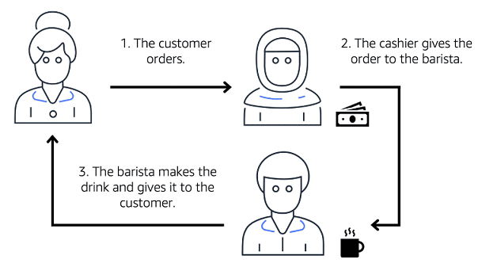

Supongamos que la cafetería tiene un proceso de pedido en el que un cajero toma pedidos y un barista hace los pedidos. Piense en el cajero y el barista como dos componentes separados de una aplicación. 

Primero, el cajero toma un pedido y lo escribe en un pedazo de papel. A continuación, el cajero entrega el papel al barista. Finalmente, el barista hace la bebida y se la da al cliente.

Cuando llega el siguiente pedido, el proceso se repite. Este proceso se desarrolla sin problemas, siempre y cuando tanto el cajero como el barista estén coordinados.

¿Qué podría suceder si el cajero tomara un pedido y fuera a entregarlo al barista, pero el barista estaba en un descanso u ocupado con otro pedido? El cajero tendría que esperar hasta que el barista esté listo para aceptar el pedido. Esto causaría retrasos en el proceso de pedido y requeriría que los clientes esperen más tiempo para recibir sus pedidos.

A medida que la cafetería se ha vuelto más popular y la línea de pedidos se mueve más lentamente, los propietarios notan que el proceso de pedido actual consume mucho tiempo y es ineficiente. Deciden probar un enfoque diferente que utiliza una cola.

**Ejemplo: Pedidos en una cola**

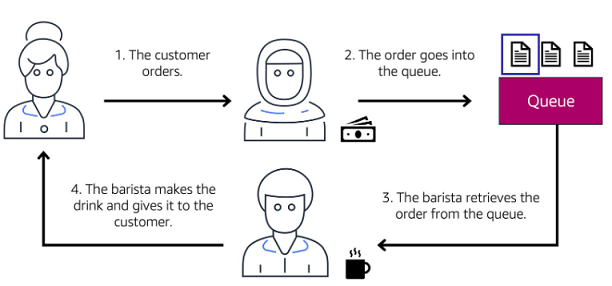

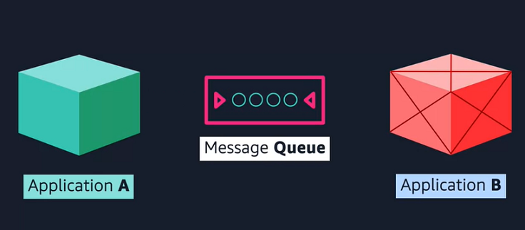

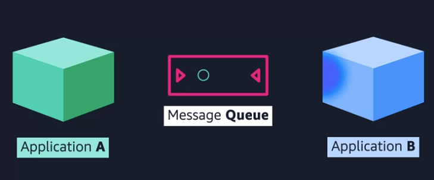

Recuerde que el cajero y el barista son dos componentes separados de una solicitud. Un servicio de cola de mensajes como Amazon SQS permite mensajes entre componentes de aplicaciones desacoplados.

En este ejemplo, el primer paso en el proceso sigue siendo el mismo que antes: un cliente realiza un pedido con el cajero. 

El cajero pone el pedido en una cola. Puede pensar en esto como un tablero de pedidos que sirve como un amortiguador entre el cajero y el barista. Incluso si el barista está en un descanso u ocupado con otro pedido, el cajero puede continuar colocando nuevos pedidos en la cola. 

A continuación, el barista comprueba la cola y recupera el pedido.

El barista prepara la bebida y se la da al cliente. 

A continuación, el barista elimina el pedido completado de la cola. 

Mientras el barista prepara la bebida, el cajero puede seguir tomando nuevos pedidos y agregarlos a la cola.

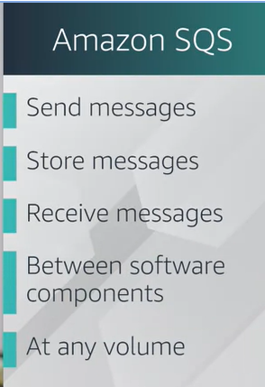

## Servicios informáticos adicionales

Si está tratando de alojar aplicaciones tradicionales y desea acceso completo al sistema operativo subyacente, como Linux o Windows, querrá usar EC2. 

Si desea alojar funciones de ejecución corta, aplicaciones orientadas a servicios o basadas en eventos, y no desea administrar el entorno subyacente en absoluto, consulte AWS Lambda sin servidor. 

Si desea ejecutar cargas de trabajo basadas en contenedores de Docker en AWS, primero debe elegir su herramienta de orquestación. ¿Desea utilizar Amazon ECS o Amazon EKS? Después de elegir su herramienta, debe elegir su plataforma. ¿Desea ejecutar sus contenedores en instancias EC2 que administra o en un entorno sin servidor como AWS Fargate, que se administra por usted?

## Informática sin servidor

Anteriormente en este módulo, aprendió sobre Amazon EC2, un servicio que le permite ejecutar servidores virtuales en la nube. Si tiene aplicaciones que desea ejecutar en Amazon EC2, debe hacer lo siguiente:

1. Aprovisionamiento de instancias (servidores virtuales).
2. Sube tu código.
3. Continúe administrando las instancias mientras se ejecuta la aplicación.

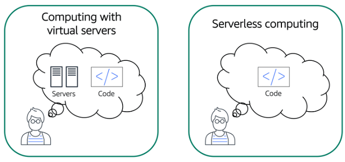

El término "sin servidor" significa que el código se ejecuta en servidores, pero no es necesario aprovisionar ni administrar estos servidores. Con la informática sin servidor, puede centrarse más en innovar nuevos productos y características en lugar de mantener servidores.

Otro beneficio de la informática sin servidor es la flexibilidad para escalar aplicaciones sin servidor automáticamente. La computación sin servidor puede ajustar la capacidad de las aplicaciones modificando las unidades de consumo, como el rendimiento y la memoria. 

Un servicio de AWS para informática sin servidor es **AWS Lambda**.

**AWS Lambda**

[AWS Lambda](https://aws.amazon.com/lambda) es un servicio que le permite ejecutar código sin necesidad de aprovisionar ni administrar servidores. 

Mientras utiliza AWS Lambda, solo paga por el tiempo de cómputo que consume. Los cargos solo se aplican cuando el código se está ejecutando. También puede ejecutar código para prácticamente cualquier tipo de aplicación o servicio back-end, todo con cero administración. 

Por ejemplo, una función simple de Lambda podría implicar cambiar automáticamente el tamaño de las imágenes cargadas en la nube de AWS. En este caso, la función se activa al cargar una nueva imagen.

**Cómo funciona AWS Lambda**

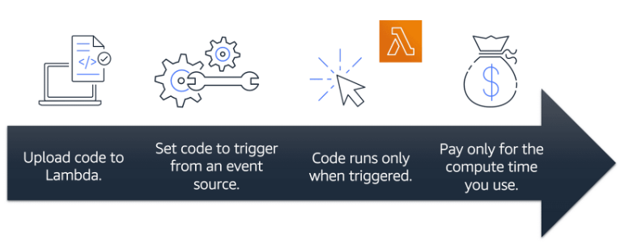

1. Cargue el código en Lambda. 
2. Configure el código para que se active desde un origen de eventos, como servicios de AWS, aplicaciones móviles o puntos de enlace HTTP.
3. Lambda ejecuta el código solo cuando se activa.
4. Solo paga por el tiempo de cómputo que utiliza. En el ejemplo anterior de cambio de tamaño de imágenes, solo pagaría por el tiempo de cómputo que usa al cargar nuevas imágenes. La carga de las imágenes activa Lambda para ejecutar código para la función de cambio de tamaño de la imagen.

**Recipientes**

En AWS, también puede crear y ejecutar aplicaciones **en contenedores**.

**Los contenedores** proporcionan una forma estándar de empaquetar el código y las dependencias de la aplicación en un solo objeto. También puede usar contenedores para procesos y flujos de trabajo en los que existen requisitos esenciales de seguridad, confiabilidad y escalabilidad.

Ejemplos:
Un host con varios contenedores

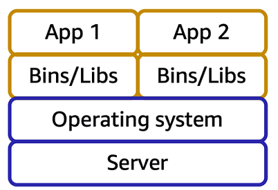

upongamos que el desarrollador de aplicaciones de una empresa tiene un entorno en su equipo que es diferente del entorno de los equipos utilizados por el personal de operaciones de TI. El desarrollador quiere asegurarse de que el entorno de la aplicación permanezca coherente independientemente de la implementación, por lo que utiliza un enfoque en contenedores. Esto ayuda a reducir el tiempo dedicado a la depuración de aplicaciones y al diagnóstico de diferencias en entornos informáticos.

**Decenas de anfitriones con cientos de contenedores**

Al ejecutar aplicaciones en contenedores, es importante tener en cuenta la escalabilidad. Supongamos que en lugar de un solo host con varios contenedores, tiene que administrar decenas de hosts con cientos de contenedores. Alternativamente, debe administrar posiblemente cientos de hosts con miles de contenedores. A gran escala, imagine cuánto tiempo le llevará supervisar el uso de la memoria, la seguridad, el registro, etc.

**Amazon Elastic Container Service (Amazon ECS) [Amazon Elastic Container Service (Amazon ECS)](https://aws.amazon.com/es/ecs/) es un sistema de administración de contenedores altamente escalable y de alto rendimiento que le permite ejecutar y escalar aplicaciones en contenedores en AWS.**

Amazon ECS admite contenedores Docker. [Docker](https://www.docker.com/) es una plataforma de software que le permite crear, probar e implementar aplicaciones rápidamente. AWS admite el uso de Docker Community Edition de código abierto y Docker Enterprise Edition basado en suscripción. Con Amazon ECS, puede utilizar llamadas a la API para lanzar y detener aplicaciones habilitadas para Docker.

## Recursos

Para obtener más información sobre los conceptos que se exploraron en el Módulo 2, revise estos recursos.

- [Computación en AWS](https://aws.amazon.com/es/products/compute/)
- [AWS Compute Blog](https://aws.amazon.com/es/blogs/compute/)
- [Servicios informáticos de AWS](https://docs.aws.amazon.com/whitepapers/latest/aws-overview/compute-services.html)
- [Tutoriales prácticos: Computación](https://aws.amazon.com/es/getting-started/hands-on/?awsf.getting-started-category=category%23compute&awsf.getting-started-content-type=content-type%23hands-on)
- [Categoría Deep Dive: Sin servidor](https://aws.amazon.com/es/getting-started/deep-dive-serverless/)
- [Historias de clientes de AWS: sin servidor](https://aws.amazon.com/es/solutions/case-studies/?customer-references-cards.sort-by=item.additionalFields.publishedDate&customer-references-cards.sort-order=desc&awsf.customer-references-location=*all&awsf.customer-references-segment=*all&awsf.customer-references-product=product%23vpc%7Cproduct%23api-gateway%7Cproduct%23cloudfront%7Cproduct%23route53%7Cproduct%23directconnect%7Cproduct%23elb&awsf.customer-references-category=category%23serverless&awsf.content-type=*all&awsf.customer-references-industry=*all&awsf.customer-references-use-case=*all&awsf.customer-references-tech-category=*all)