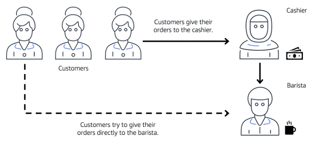
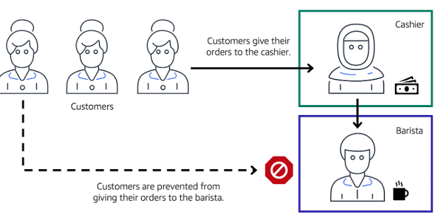

# AWS Cloud Practitioner Essentials

# Module 3: AWS Global Infrastructure and Reliability

## Selección de una región

Al determinar la región correcta para sus servicios, datos y aplicaciones, tenga en cuenta los siguientes cuatro factores empresariales. 

**Cumplimiento de los requisitos legales y de gobierno de datos**

Dependiendo de su empresa y ubicación, es posible que deba ejecutar sus datos fuera de áreas específicas. Por ejemplo, si su empresa requiere que todos sus datos residan dentro de los límites del Reino Unido, debe elegir la región de Londres. 

No todas las empresas tienen regulaciones de datos específicas de la ubicación, por lo que es posible que deba centrarse más en los otros tres factores.

**Proximidad a sus clientes**

Seleccionar una región que esté cerca de sus clientes le ayudará a obtener contenido para ellos más rápido. Por ejemplo, su empresa tiene su sede en Washington, DC, y muchos de sus clientes viven en Singapur. Puede considerar ejecutar su infraestructura en la región del norte de Virginia para estar cerca de la sede de la empresa y ejecutar sus aplicaciones desde la región de Singapur.

**Servicios disponibles dentro de una región**

A veces, es posible que la región más cercana no tenga todas las características que desea ofrecer a los clientes. CON FRECUENCIA, AWS innova mediante la creación de nuevos servicios y la ampliación de las características dentro de los servicios existentes. Sin embargo, hacer que los nuevos servicios estén disponibles en todo el mundo a veces requiere que AWS construya hardware físico de una región a la vez. 

Supongamos que sus desarrolladores desean crear una aplicación que utilice Amazon Braket (plataforma de computación cuántica de AWS). A partir de este curso, Amazon Braket aún no está disponible en todas las regiones de AWS del mundo, por lo que sus desarrolladores tendrían que ejecutarlo en una de las regiones que ya lo ofrece.

**Precios**

Supongamos que está considerando ejecutar aplicaciones tanto en los Estados Unidos como en Brasil. La forma en que se establece la estructura tributaria de Brasil, podría costar un 50% más ejecutar la misma carga de trabajo fuera de la Región de São Paulo en comparación con la Región de Oregón. Aprenderá con más detalle que varios factores determinan los precios, pero por ahora sepa que el costo de los servicios puede variar de una región a otra.

# Selección de una región

Al determinar la región correcta para sus servicios, datos y aplicaciones, tenga en cuenta los siguientes cuatro factores empresariales. 

**Cumplimiento de los requisitos legales y de gobierno de datos**

Dependiendo de su empresa y ubicación, es posible que deba ejecutar sus datos fuera de áreas específicas. Por ejemplo, si su empresa requiere que todos sus datos residan dentro de los límites del Reino Unido, debe elegir la región de Londres. 

No todas las empresas tienen regulaciones de datos específicas de la ubicación, por lo que es posible que deba centrarse más en los otros tres factores.

**Proximidad a sus clientes**

Seleccionar una región que esté cerca de sus clientes le ayudará a obtener contenido para ellos más rápido. Por ejemplo, su empresa tiene su sede en Washington, DC, y muchos de sus clientes viven en Singapur. Puede considerar ejecutar su infraestructura en la región del norte de Virginia para estar cerca de la sede de la empresa y ejecutar sus aplicaciones desde la región de Singapur.

**Servicios disponibles dentro de una región**

A veces, es posible que la región más cercana no tenga todas las características que desea ofrecer a los clientes. CON FRECUENCIA, AWS innova mediante la creación de nuevos servicios y la ampliación de las características dentro de los servicios existentes. Sin embargo, hacer que los nuevos servicios estén disponibles en todo el mundo a veces requiere que AWS construya hardware físico de una región a la vez. 

Supongamos que sus desarrolladores desean crear una aplicación que utilice Amazon Braket (plataforma de computación cuántica de AWS). A partir de este curso, Amazon Braket aún no está disponible en todas las regiones de AWS del mundo, por lo que sus desarrolladores tendrían que ejecutarlo en una de las regiones que ya lo ofrece.

**Precios**

Supongamos que está considerando ejecutar aplicaciones tanto en los Estados Unidos como en Brasil. La forma en que se establece la estructura tributaria de Brasil, podría costar un 50% más ejecutar la misma carga de trabajo fuera de la Región de São Paulo en comparación con la Región de Oregón. Aprenderá con más detalle que varios factores determinan los precios, pero por ahora sepa que el costo de los servicios puede variar de una región a otra.

## Zonas de disponibilidad

Una **zona de disponibilidad** es un único centro de datos o un grupo de centros de datos dentro de una región. Las zonas de disponibilidad se encuentran a decenas de millas de distancia entre sí. Esto es lo suficientemente cercano como para tener una latencia baja (el tiempo entre el momento en que se solicita y recibe el contenido) entre las zonas de disponibilidad. Sin embargo, si ocurre un desastre en una parte de la región, están lo suficientemente distantes como para reducir la posibilidad de que se vean afectadas varias zonas de disponibilidad.

**Ejecución de instancias Amazon EC2 en varias zonas de disponibilidad**

**Instancia Amazon EC2 en una única zona de disponibilidad**

Supongamos que está ejecutando una aplicación en una sola instancia Amazon EC2 en la región norte de California. La instancia se está ejecutando en la zona de disponibilidad us-west-1a. Si us-west-1a fallara, perdería su instancia. 

**Instancias Amazon EC2 en varias zonas de disponibilidad**

Una práctica recomendada es ejecutar aplicaciones en al menos dos zonas de disponibilidad de una región. En este ejemplo, puede optar por ejecutar una segunda instancia Amazon EC2 en us-west-1b.

**Error de zona de disponibilidad**

Si us-west-1a fallara, su aplicación seguiría ejecutándose en us-west-1b.

## Ubicaciones de borde

Una ubicación de borde es un sitio que Amazon CloudFront utiliza para almacenar copias en caché de su contenido más cerca de sus clientes para una entrega más rápida.

**Origen Supongamos que los datos de su empresa se almacenan en Brasil y tiene clientes que viven en China. Para proporcionar contenido a estos clientes, no es necesario mover todo el contenido a una de las regiones chinas.**

**Ubicación del borde**

En lugar de requerir que sus clientes obtengan sus datos de Brasil, puede almacenar en caché una copia localmente en una ubicación de borde que esté cerca de sus clientes en China.

**Cliente**
Cuando un cliente en China solicita uno de sus archivos, Amazon CloudFront recupera el archivo de la memoria caché en la ubicación de borde y lo entrega al cliente. El archivo se entrega al cliente más rápido porque proviene de la ubicación de borde cerca de China en lugar de la fuente original en Brasil.

Hay mucho más que podemos decir sobre nuestra infraestructura global de AWS, pero mantengámoslo simple y detengámonos aquí. Estos son los puntos clave. 

En primer lugar, las regiones son áreas geográficamente aisladas donde puede acceder a los servicios necesarios para ejecutar su empresa. 

Número dos, las regiones contienen zonas de disponibilidad que le permiten correr a través de edificios físicamente separados, decenas de millas de separación, mientras mantiene su aplicación lógicamente unificada. Las zonas de disponibilidad le ayudan a resolver escenarios de alta disponibilidad y recuperación ante desastres sin ningún esfuerzo adicional de su parte. 

En tercer lugar, las ubicaciones de borde de AWS ejecutan Amazon CloudFront para ayudar a acercar el contenido a sus clientes sin importar en qué parte del mundo se encuentren.

**Recursos**

- [Amazon CloudFront](https://aws.amazon.com/es/cloudfront/)
- [Características clave de Amazon CloudFront](https://aws.amazon.com/es/cloudfront/features/?nc=sn&loc=2&whats-new-cloudfront.sort-by=item.additionalFields.postDateTime&whats-new-cloudfront.sort-order=desc#Amazon_CloudFront_Infrastructure)
- [Familia de AWS Outposts](https://aws.amazon.com/es/outposts/)

## Cómo aprovisionar recursos de AWS (Parte 1)

¿cómo interactúo realmente con estos servicios? La respuesta son las API. En AWS, todo es una llamada a la API. **Una API es una interfaz de programación de aplicaciones**. Lo que eso significa es que hay formas predeterminadas de interactuar con los servicios de AWS. Puede invocar o llamar a estas API para aprovisionar, configurar y administrar sus recursos de AWS. 

Por ejemplo, puede lanzar una instancia EC2 o puede crear una función de AWS Lambda. Cada una de ellas serían solicitudes diferentes y diferentes llamadas a la API a AWS. Puede utilizar:

- la consola de administración de AWS
- la interfaz de línea de comandos de AWS
- los kits de desarrollo de software de AWS
- otras herramientas como AWS CloudFormation para crear solicitudes para enviar a las API de AWS para crear y administrar recursos de AWS. 

En primer lugar, hablemos de la consola de administración de AWS. La consola de administración de AWS está basada en navegador. A través de la consola, puede administrar sus recursos de AWS de forma visual y fácil de digerir. Esto es ideal para comenzar y desarrollar su conocimiento de los servicios. También es útil para crear entornos de prueba o ver facturas de AWS, ver, monitorear y trabajar con otros recursos no técnicos. Lo más probable es que la consola de administración de AWS sea el primer lugar al que acudirá cuando aprenda sobre AWS. Sin embargo, una vez que esté en funcionamiento en un entorno de tipo de producción, no querrá confiar en el estilo de apuntar y hacer clic que le ofrece la consola para crear y administrar sus recursos de AWS. Por ejemplo, para crear una instancia Amazon EC2, debe hacer clic en varias pantallas, establecer todas las configuraciones que desee y, a continuación, lanzar la instancia. Si más tarde desea lanzar otra instancia EC2, deberá volver a la consola y hacer clic en sus pantallas nuevamente para ponerla en funcionamiento. 

Al hacer que los humanos hagan este aprovisionamiento manual, te estás abriendo a posibles errores. Es bastante fácil olvidarse de marcar una casilla de verificación o escribir mal algo cuando está haciendo todo manualmente. La respuesta a este problema es utilizar herramientas que le permitan crear scripts o programar las llamadas a la API. 

Una herramienta que puede utilizar es la AWS Command Line Interface o CLI. **La CLI le permite realizar llamadas a la API utilizando el terminal de su máquina**. Esto es diferente del estilo de navegación visual de la consola de administración. 

Escribir comandos usando la CLI hace que las acciones sean secuencias de comandos y repetibles. Por lo tanto, puede escribir y ejecutar sus comandos para lanzar una instancia EC2, y si desea lanzar otra, puede ejecutar el comando preescrito nuevamente. Esto lo hace menos susceptible al error humano. Puede hacer que estos scripts se ejecuten automáticamente, como en una programación o activados por otro proceso. La automatización es muy importante para tener una implementación en la nube exitosa y predecible a lo largo del tiempo. 

Otra forma de interactuar con AWS es a través de los kits de desarrollo de software o SDK de AWS. **Los SDK le permiten interactuar con los recursos de AWS a través de varios lenguajes de programación**. Esto facilita a los desarrolladores la creación de programas que utilizan AWS sin utilizar las API de bajo nivel, además de evitar esa creación manual de recursos de la que acabamos de hablar. Más sobre eso en un momento.

## Formas de interactuar con los servicios de AWS

**Consola de administración de AWS**

La consola de administración de AWS es una interfaz basada en web para acceder y administrar los servicios de AWS. Puede acceder rápidamente a los servicios utilizados recientemente y buscar otros servicios por nombre, palabra clave o acrónimo. La consola incluye asistentes y flujos de trabajo automatizados que pueden simplificar el proceso de completar tareas. También puede utilizar la aplicación móvil de la consola de AWS para realizar tareas como la supervisión de recursos, la visualización de alarmas y el acceso a la información de facturación. Varias identidades pueden permanecer conectadas a la aplicación móvil de la consola de AWS al mismo tiempo.

**Interfaz de línea de comandos de AWS**

Para ahorrar tiempo al realizar solicitudes de API, puede utilizar la AWS Command Line Interface (AWS CLI). La AWS CLI le permite controlar varios servicios de AWS directamente desde la línea de comandos dentro de una herramienta. La AWS CLI está disponible para usuarios de Windows, macOS y Linux. 

Mediante el uso de la AWS CLI, puede automatizar las acciones que realizan sus servicios y aplicaciones a través de scripts. Por ejemplo, puede utilizar comandos para lanzar una instancia Amazon EC2, conectar una instancia Amazon EC2 a un grupo específico de Auto Scaling y mucho más.

**Kits de desarrollo de software (SDK)**

Otra opción para acceder y administrar los servicios de AWS son los kits de desarrollo de software (SDK). Los SDK facilitan el uso de los servicios de AWS a través de una API diseñada para su lenguaje de programación o plataforma. Los SDK le permiten utilizar los servicios de AWS con sus aplicaciones existentes o crear aplicaciones completamente nuevas que se ejecutarán en AWS.

Para ayudarle a empezar a utilizar los SDK, AWS proporciona documentación y código de muestra para cada lenguaje de programación compatible. Los lenguajes de programación compatibles incluyen C++, Java, .NET y más.

## Cómo aprovisionar recursos de AWS (Parte 2)

Muy bien, sigamos hablando sobre cómo interactuar con AWS. Tiene la consola de administración de AWS, la CLI y los SDK, que son formas de aprovisionar y administrar su entorno de AWS.

Si desea aprovisionar un recurso, puede iniciar sesión en la consola y apuntar y hacer clic, puede escribir algunos comandos o puede escribir algunos programas para hacerlo.

También hay otras formas de administrar su entorno de AWS mediante herramientas administradas como AWS Elastic Beanstalk y AWS CloudFormation. AWS Elastic Beanstalk es un servicio que le ayuda a aprovisionar entornos basados en Amazon EC2. En lugar de hacer clic en la consola o escribir varios comandos para crear su red, instancias EC2, escalado y equilibradores de carga elásticos, puede proporcionar el código de la aplicación y las configuraciones deseadas al servicio AWS Elastic Beanstalk, que luego toma esa información y crea su entorno por usted.

AWS Elastic Beanstalk también facilita el almacenamiento de configuraciones de entorno, por lo que se pueden volver a implementar fácilmente. AWS Elastic Beanstalk le ofrece la comodidad de no tener que aprovisionar y administrar todas estas piezas por separado, al tiempo que le brinda visibilidad y control de los recursos subyacentes. Puede centrarse en su aplicación empresarial, no en la infraestructura.

Otro servicio que puede utilizar para ayudar a crear implementaciones automatizadas y repetibles es AWS CloudFormation.

AWS CloudFormation es una herramienta de infraestructura como código que le permite definir una amplia variedad de recursos de AWS de forma declarativa mediante documentos basados en texto JSON o YAML, denominados plantillas de CloudFormation.

Un formato declarativo como este le permite definir lo que desea construir, sin especificar los detalles de cómo construirlo exactamente.

CloudFormation le permite definir lo que desea, y el motor de CloudFormation se preocupará por los detalles sobre cómo llamar a las API para obtener todo construido.

Tampoco se limita solo a las soluciones basadas en EC2. CloudFormation admite muchos recursos diferentes de AWS, desde almacenamiento, bases de datos, análisis, aprendizaje automático y más.

Una vez que haya definido los recursos en una plantilla de CloudFormation, CloudFormation analizará la plantilla y comenzará a aprovisionar todos los recursos que definió en paralelo.

CloudFormation administra todas las llamadas a las API de AWS back-end por usted. Puede ejecutar la misma plantilla de formación de nube y varias cuentas o varias regiones, y creará entornos idénticos en todas ellas. Hay menos espacio para el error humano, ya que es un proceso totalmente automatizado.

En resumen, la consola de administración de AWS es ideal para aprender y proporcionar una imagen visual para el usuario. La consola de administración de AWS es una herramienta manual, por lo que de inmediato, no es una excelente opción para la automatización.

En su lugar, puede utilizar la CLI para crear scripts de sus interacciones con AWS mediante el terminal. Puede utilizar los SDK para escribir programas, interactuar con AWS por usted o puede utilizar herramientas administradas como AWS Elastic Beanstalk o AWS CloudFormation.

## AWS Elastic Beanstalk y AWS CloudFormation 

**AWS Elastic Beanstalk**

Con **AWS Elastic Beanstalk**, proporciona código y opciones de configuración, y Elastic Beanstalk implementa los recursos necesarios para realizar las siguientes tareas:

- Ajustar la capacidad
- Equilibrio de carga
- Escalado automático
- Supervisión del estado de las aplicaciones

**AWS CloudFormation**

Con **AWS CloudFormation**, puede tratar su infraestructura como código. Esto significa que puede crear un entorno escribiendo líneas de código en lugar de utilizar la consola de administración de AWS para aprovisionar recursos individualmente.

AWS CloudFormation aprovisiona sus recursos de forma segura y repetible, lo que le permite crear con frecuencia su infraestructura y aplicaciones sin tener que realizar acciones manuales o escribir scripts personalizados. Determina las operaciones correctas que debe realizar al administrar la pila y revierte los cambios automáticamente si detecta errores.

## Resumen del módulo 3

Cubrimos cómo los clústeres lógicos de centros de datos conforman las zonas de disponibilidad. Las zonas de disponibilidad, a su vez, conforman regiones y esas se extienden a nivel mundial. A continuación, elija las regiones y zonas de disponibilidad desde las que desea operar. Y como práctica recomendada, siempre debe implementar infraestructura en al menos dos zonas de disponibilidad. 

Y algunos servicios de AWS como Elastic Load Balancing, Amazon SQS y Amazon SNS ya lo hacen por usted. 

También hablamos sobre las ubicaciones de borde y cómo puede implementar contenido allí para acelerar la entrega a sus clientes. Incluso mencionamos dispositivos de borde como los puestos avanzados de AWS que le permiten ejecutar la infraestructura de AWS directamente en su propio centro de datos. 

Otra cosa que discutimos fue cómo aprovisionar recursos de AWS a través de varias opciones, como la consola de administración de AWS, el SDK, la CLI, AWS, Elastic Beanstalk y AWS CloudFormation. Donde aprendió cómo puede configurar su infraestructura como código. 

## Recursos

Revise estos recursos para obtener más información sobre los conceptos que se exploraron en el Módulo 3.

- [Infraestructura global de AWS](https://aws.amazon.com/es/about-aws/global-infrastructure/)
- [Regiones y zonas de disponibilidad](https://aws.amazon.com/es/about-aws/global-infrastructure/regions_az/)
- [AWS Networking and Content Delivery Blog](https://aws.amazon.com/es/blogs/networking-and-content-delivery/)
- [Herramientas para crear en AWS](https://aws.amazon.com/es/tools/)
- [Historias de clientes de AWS: entrega de contenido](https://aws.amazon.com/solutions/case-studies/?customer-references-cards.sort-by=item.additionalFields.publishedDate&customer-references-cards.sort-order=desc&awsf.customer-references-location=*all&awsf.customer-references-segment=*all&awsf.customer-references-product=product%23vpc%7Cproduct%23api-gateway%7Cproduct%23cloudfront%7Cproduct%23route53%7Cproduct%23directconnect%7Cproduct%23elb&awsf.customer-references-category=category%23content-delivery)

# Module 4: Networking

## Conectividad con AWS

**Amazon Virtual Private Cloud (Amazon VPC)**

Imagine los millones de clientes que utilizan los servicios de AWS. Además, imagine los millones de recursos que estos clientes han creado, como las instancias Amazon EC2. Sin límites alrededor de todos estos recursos, el tráfico de red podría fluir entre ellos sin restricciones. 

Un servicio de red que puede utilizar para establecer límites en torno a sus recursos de AWS es [Amazon Virtual Private Cloud (Amazon VPC)](https://aws.amazon.com/es/vpc/).

Amazon VPC le permite aprovisionar una sección aislada de la nube de AWS. En esta sección aislada, puede iniciar recursos en una red virtual que defina. Dentro de una nube privada virtual (VPC), puede organizar sus recursos en subredes. Una **subred** es una sección de una VPC que puede contener recursos como instancias Amazon EC2.

**Puerta de enlace a Internet**

Para permitir que el tráfico público de Internet acceda a la VPC, debe adjuntar una puerta de enlace de Internet a la VPC.

Una puerta de enlace a Internet es una conexión entre una VPC e Internet. Puede pensar que una puerta de enlace a Internet es similar a una puerta que los clientes usan para ingresar a la cafetería. Sin una puerta de enlace a Internet, nadie puede acceder a los recursos de su VPC.

**¿Qué sucede si tiene una VPC que solo incluye recursos privados?**

**Puerta de enlace privada virtual**

A continuación se muestra un ejemplo de cómo funciona una puerta de enlace privada virtual. Puede pensar en Internet como el camino entre su hogar y la cafetería. Supongamos que viajas por esta carretera con un guardaespaldas que te proteja. Sigue utilizando el mismo camino que otros clientes, pero con una capa adicional de protección. 

El guardaespaldas es como una conexión de red privada virtual (VPN) que cifra (o protege) su tráfico de Internet de todas las demás solicitudes a su alrededor. 

La puerta de enlace privada virtual es el componente que permite que el tráfico de Internet protegido entre en la VPC. A pesar de que su conexión a la cafetería tiene protección adicional, los atascos de tráfico son posibles porque está utilizando la misma carretera que otros clientes.

Una puerta de enlace privada virtual le permite establecer una conexión de red privada virtual (VPN) entre su VPC y una red privada, como un centro de datos local o una red corporativa interna. Una puerta de enlace privada virtual permite el tráfico en la VPC solo si proviene de una red aprobada.

**Conexión directa de AWS**

[AWS Direct Connect](https://aws.amazon.com/es/directconnect/) es un servicio que le permite establecer una conexión privada dedicada entre su centro de datos y una VPC. 

Supongamos que hay un edificio de apartamentos con un pasillo que conecta directamente el edificio con la cafetería. Solo los residentes del edificio de apartamentos pueden viajar a través de este pasillo. 

Este pasillo privado proporciona el mismo tipo de conexión dedicada que AWS Direct Connect. Los residentes pueden entrar en la cafetería sin necesidad de utilizar la vía pública compartida con otros clientes. 

La conexión privada que proporciona AWS Direct Connect le ayuda a reducir los costos de red y aumentar la cantidad de ancho de banda que puede viajar a través de su red.

## Subredes y listas de control de acceso a la red
Para obtener más información sobre la función de las subredes dentro de una VPC, consulte el siguiente ejemplo de la cafetería.

Primero, los clientes dan sus pedidos al cajero. El cajero luego pasa las órdenes al barista. Este proceso permite que la línea siga funcionando sin problemas a medida que ingresan más clientes. 

Supongamos que algunos clientes intentan saltarse la fila del cajero y dar sus pedidos directamente al barista. Esto interrumpe el flujo de tráfico y hace que los clientes accedan a una parte de la cafetería que está restringida a ellos.

Para solucionar esto, los propietarios de la cafetería dividen el área del mostrador colocando el cajero y el barista en estaciones de trabajo separadas. La estación de trabajo del cajero es pública y está diseñada para recibir clientes. El área del barista es privada. El barista aún puede recibir pedidos del cajero, pero no directamente de los clientes.

Esto es similar a cómo puede utilizar los servicios de red de AWS para aislar los recursos y determinar exactamente cómo fluye el tráfico de red.

En la cafetería, puede pensar en el área del mostrador como una VPC. El área del mostrador se divide en dos áreas separadas para la estación de trabajo del cajero y la estación de trabajo del barista. En una VPC, **las subredes son áreas** independientes que se utilizan para agrupar recursos.

**Subredes**

Una subred es una sección de una VPC en la que puede agrupar recursos en función de las necesidades operativas o de seguridad. Las subredes pueden ser públicas o privadas. 

**Las subredes públicas** contienen recursos a los que el público debe poder acceder, como el sitio web de una tienda en línea.

**Las subredes privadas** contienen recursos a los que solo se debe acceder a través de la red privada, como una base de datos que contenga información personal de los clientes e historiales de pedidos. 

En una VPC, las subredes pueden comunicarse entre sí. Por ejemplo, es posible que tenga una aplicación que implique instancias Amazon EC2 en una subred pública que se comuniquen con bases de datos que se encuentran en una subred privada.

**Tráfico de red en una VPC**

Cuando un cliente solicita datos de una aplicación alojada en la nube de AWS, esta solicitud se envía como un paquete. Un **paquete** es una unidad de datos enviada a través de Internet o una red. 

Entra en una VPC a través de una puerta de enlace a Internet. Antes de que un paquete pueda entrar en una subred o salir de una subred, comprueba si hay permisos. Estos permisos indican quién envió el paquete y cómo el paquete está intentando comunicarse con los recursos de una subred.

El componente de la VPC que comprueba los permisos de paquetes para las subredes es una [lista de control de acceso a la red (ACL)](https://docs.aws.amazon.com/vpc/latest/userguide/vpc-network-acls.html).

**Listas de control de acceso a la red (ACL)**

Una lista de control de acceso a la red (ACL) es un firewall virtual que controla el tráfico entrante y saliente en el nivel de subred.

Por ejemplo, salga de la cafetería e imagine que está en un aeropuerto. En el aeropuerto, los viajeros están tratando de entrar en un país diferente. Puede pensar en los viajeros como paquetes y el oficial de control de pasaportes como una red ACL. El oficial de control de pasaportes verifica las credenciales de los viajeros cuando entran y salen del país. Si un viajero está en una lista aprobada, puede pasar. Sin embargo, si no están en la lista aprobada o están explícitamente en una lista de viajeros prohibidos, no pueden entrar.

Cada cuenta de AWS incluye una ACL de red predeterminada. Al configurar la VPC, puede utilizar la ACL de red predeterminada de su cuenta o crear ACL de red personalizadas. 

De forma predeterminada, la ACL de red predeterminada de su cuenta permite todo el tráfico entrante y saliente, pero puede modificarla agregando sus propias reglas. Para las ACL de red personalizadas, todo el tráfico entrante y saliente se deniega hasta que agregue reglas para especificar qué tráfico permitir. Además, todas las ACL de red tienen una regla de denegación explícita. Esta regla garantiza que si un paquete no coincide con ninguna de las otras reglas de la lista, el paquete se deniega. 

**Filtrado de paquetes sin estado**

Las ACL de red realizan un filtrado de paquetes **sin estado**. No recuerdan nada y comprueban los paquetes que cruzan la frontera de la subred en cada sentido: entrante y saliente. 

Recordemos el ejemplo anterior de un viajero que quiere entrar en un país diferente. Esto es similar a enviar una solicitud desde una instancia Amazon EC2 a Internet.

Cuando una respuesta de paquete para esa solicitud vuelve a la subred, la ACL de red no recuerda su solicitud anterior. La ACL de red comprueba la respuesta del paquete con su lista de reglas para determinar si se debe permitir o denegar.

Después de que un paquete haya entrado en una subred, debe tener sus permisos evaluados para los recursos dentro de la subred, como las instancias Amazon EC2. 

El componente de VPC que comprueba los permisos de paquetes para una instancia Amazon EC2 es un [grupo de seguridad](https://docs.aws.amazon.com/vpc/latest/userguide/VPC_SecurityGroups.html).

**Grupos de seguridad**

Un grupo de seguridad es un firewall virtual que controla el tráfico entrante y saliente de una instancia Amazon EC2.

De forma predeterminada, un grupo de seguridad deniega todo el tráfico entrante y permite todo el tráfico saliente. Puede agregar reglas personalizadas para configurar qué tráfico permitir o denegar.

Para este ejemplo, supongamos que se encuentra en un edificio de apartamentos con un asistente de puerta que saluda a los huéspedes en el vestíbulo. Puede pensar en los invitados como paquetes y el asistente de la puerta como un grupo de seguridad. A medida que llegan los invitados, el encargado de la puerta revisa una lista para asegurarse de que pueden ingresar al edificio. Sin embargo, el encargado de la puerta no vuelve a consultar la lista cuando los huéspedes salen del edificio.

Si tiene varias instancias de Amazon EC2 dentro de una subred, puede asociarlas con el mismo grupo de seguridad o utilizar diferentes grupos de seguridad para cada instancia. 

**Filtrado de paquetes con estado**

Los grupos de seguridad realizan un filtrado de paquetes **con estado**. Recuerdan decisiones anteriores tomadas para los paquetes entrantes.

Considere el mismo ejemplo de envío de una solicitud desde una instancia Amazon EC2 a Internet. 

Cuando una respuesta de paquete para esa solicitud vuelve a la instancia, el grupo de seguridad recuerda su solicitud anterior. El grupo de seguridad permite que la respuesta continúe, independientemente de las reglas del grupo de seguridad entrante.

Tanto las ACL de red como los grupos de seguridad le permiten configurar reglas personalizadas para el tráfico de la VPC. A medida que continúe aprendiendo más sobre la seguridad y las redes de AWS, asegúrese de comprender las diferencias entre las ACL de red y los grupos de seguridad.

---------------

la única razón técnica para usar subredes en una VPC es controlar el acceso a las puertas de enlace. Las subredes públicas tienen acceso a la puerta de enlace de Internet, las subredes privadas no. Pero las subredes también pueden controlar los permisos de tráfico.

Los paquetes son mensajes de Internet, y cada paquete que cruza los límites de la subred, se compara con algo llamado lista de control de acceso a la red o ACL de red.

Esta comprobación es para ver si el paquete tiene permisos para salir o entrar en la subred, en función de desde quién se envió y cómo está tratando de comunicarse.

Puede pensar en las ACL de la red como oficiales de control de pasaportes.

Si estás en la lista aprobada, pasas, si no estás en la lista, o si estás explícitamente en la lista de no ingresar, entonces te bloquean. La ACL de red comprueba el tráfico que entra y sale de una subred, al igual que el control de pasaportes. La lista se revisa en su camino hacia un país y en la salida. Y solo porque te dejen entrar, no significa necesariamente que te vayan a dejar salir.

El tráfico aprobado se puede enviar en su camino, y el tráfico potencialmente dañino intenta obtener el control del sistema a través de solicitudes administrativas. Se bloquean antes de tocar su objetivo. No puedes hackear lo que no puedes tocar.

Ahora, esto suena como una gran seguridad. Pero no responde a todos los problemas de control de red. Porque una ACL de red solo puede evaluar un paquete si cruza un límite de subred, dentro o fuera. No evalúa si un paquete puede llegar a una instancia EC2 específica o no. A veces tendrá varias instancias EC2 en la misma subred. Pero pueden tener diferentes reglas sobre quién puede enviar los mensajes, a qué puerto se les permite enviar esos mensajes.

Por lo tanto, también necesita seguridad de red a nivel de instancia.

## Redes globales

**Sistema de nombres de dominio (DNS)**

Supongamos que AnyCompany tiene un sitio web alojado en la nube de AWS. Los clientes ingresan la dirección web en su navegador y pueden acceder al sitio web. Esto sucede debido a la resolución del Sistema de nombres de dominio (DNS). La resolución dns implica que un servidor DNS se comunique con un servidor web.

Puede pensar en DNS como la guía telefónica de Internet. La resolución DNS es el proceso de traducir un nombre de dominio a una dirección IP. 

Por ejemplo, supongamos que desea visitar el sitio web de AnyCompany. 

1. Cuando ingresa el nombre de dominio en su navegador, esta solicitud se envía a un servidor DNS. 
2. El servidor DNS solicita al servidor web la dirección IP que corresponde al sitio web de AnyCompany.
3. El servidor web responde proporcionando la dirección IP del sitio web de AnyCompany, 192.0.2.0.

**Ruta de Amazon 53**

[Amazon Route 53](https://aws.amazon.com/es/route53/) es un servicio web DNS. Ofrece a los desarrolladores y las empresas una forma fiable de enrutar a los usuarios finales a las aplicaciones de Internet alojadas en AWS. 

Amazon Route 53 conecta las solicitudes de los usuarios a la infraestructura que se ejecuta en AWS (como las instancias Amazon EC2 y los equilibradores de carga). Puede enrutar a los usuarios a una infraestructura fuera de AWS.

Otra característica de Route 53 es la capacidad de administrar los registros DNS de los nombres de dominio. Puede registrar nuevos nombres de dominio directamente en Route 53. También puede transferir registros DNS para nombres de dominio existentes administrados por otros registradores de dominios. Esto le permite administrar todos sus nombres de dominio dentro de una sola ubicación.

En el módulo anterior, aprendió sobre Amazon CloudFront, un servicio de entrega de contenido. En el ejemplo siguiente se describe cómo Route 53 y Amazon CloudFront trabajan juntos para entregar contenido a los clientes.

**Ejemplo: Cómo Amazon Route 53 y Amazon CloudFront entregan contenido**

Supongamos que la aplicación de AnyCompany se ejecuta en varias instancias Amazon EC2. Estas instancias se encuentran en un grupo de Auto Scaling que se adjunta a un balanceador de carga de aplicaciones. 

1. Un cliente solicita datos de la aplicación yendo al sitio web de AnyCompany. 
2. Amazon Route 53 utiliza la resolución DNS para identificar la dirección IP correspondiente de AnyCompany.com, 192.0.2.0. Esta información se envía de vuelta al cliente. 
3. La solicitud del cliente se envía a la ubicación de borde más cercana a través de Amazon CloudFront. 
4. Amazon CloudFront se conecta al balanceador de carga de aplicaciones, que envía el paquete entrante a una instancia Amazon EC2.

## Recursos

Para obtener más información sobre los conceptos que se exploraron en el Módulo 4, revise estos recursos.

- [Entrega de contenido y redes en AWS](https://aws.amazon.com/es/products/networking/)
- [AWS Networking & Content Delivery Blog](https://aws.amazon.com/es/blogs/networking-and-content-delivery/)
- [Nube privada virtual de Amazon](https://aws.amazon.com/es/vpc/)
- [¿Qué es Amazon VPC?](https://docs.aws.amazon.com/vpc/latest/userguide/what-is-amazon-vpc.html)
- [Cómo funciona Amazon VPC](https://docs.aws.amazon.com/vpc/latest/userguide/how-it-works.html)