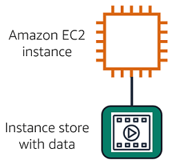
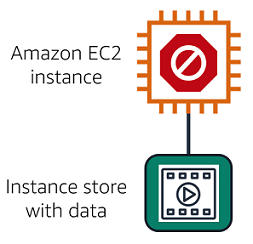
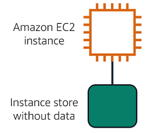
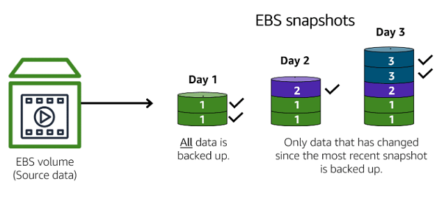
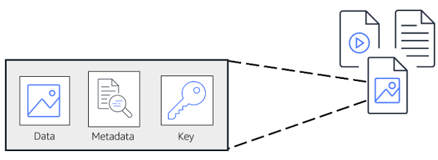
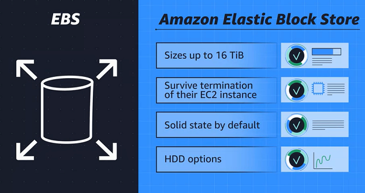
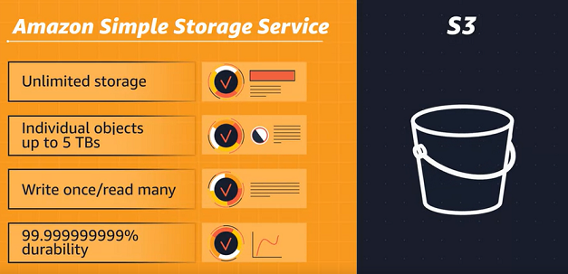
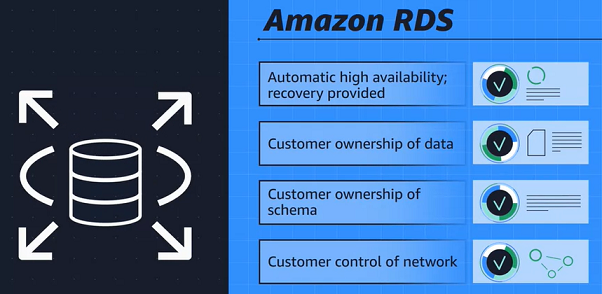
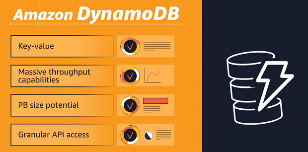
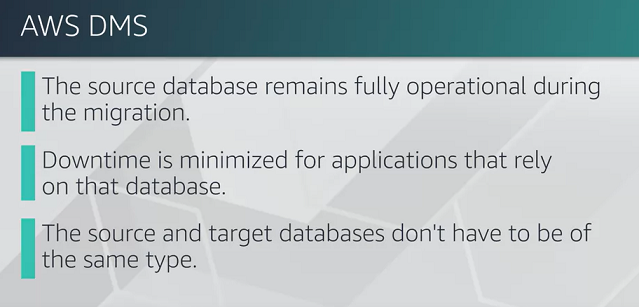

# AWS Cloud Practitioner Essentials

# Module 5: Storage and Daatabases

## Almacenes de instancias y Amazon Elastic Block Store (Amazon EBS)

**Almacenes de instancias**

Los volúmenes de almacenamiento a nivel de bloque se comportan como discos duros físicos.

Un [almacén de instancias](https://docs.aws.amazon.com/AWSEC2/latest/UserGuide/InstanceStorage.html) proporciona almacenamiento temporal a nivel de bloque para una instancia Amazon EC2. Un almacén de instancias es un almacenamiento en disco que está conectado físicamente al equipo host para una instancia EC2 y, por lo tanto, tiene la misma vida útil que la instancia. Cuando se termina la instancia, se pierden todos los datos del almacén de instancias.

**Se está ejecutando una instancia Amazon EC2 con un almacén de instancias adjuntas.**

**La instancia se detiene o termina.**

**Se eliminan todos los datos del almacén de instancias adjunto.**

**Almacenamiento en bloque de Amazon Elastic (Amazon EBS)**

[Amazon Elastic Block Store (Amazon EBS)](https://aws.amazon.com/es/ebs/) es un servicio que proporciona volúmenes de almacenamiento a nivel de bloque que puede utilizar con instancias Amazon EC2. Si detiene o finaliza una instancia Amazon EC2, todos los datos del volumen de EBS adjunto seguirán estando disponibles.

Para crear un volumen de EBS, defina la configuración (como el tamaño y el tipo de volumen) y aprovisione. Después de crear un volumen de EBS, se puede adjuntar a una instancia Amazon EC2.

Dado que los volúmenes de EBS son para datos que deben persistir, es importante realizar una copia de seguridad de los datos. Puede realizar copias de seguridad incrementales de volúmenes de EBS mediante la creación de instantáneas de Amazon EBS.

**Instantáneas de Amazon EBS**

[Una instantánea de EBS](https://docs.aws.amazon.com/AWSEC2/latest/UserGuide/EBSSnapshots.html) es una copia de seguridad incremental. Esto significa que la primera copia de seguridad realizada de un volumen copia todos los datos. Para las copias de seguridad posteriores, solo se guardan los bloques de datos que han cambiado desde la instantánea más reciente. 

Las copias de seguridad incrementales son diferentes de las copias de seguridad completas, en las que todos los datos de un volumen de almacenamiento se copian cada vez que se realiza una copia de seguridad. La copia de seguridad completa incluye datos que no han cambiado desde la copia de seguridad más reciente.

## Servicio de almacenamiento simple de Amazon (Amazon S3)

**Almacenamiento de objetos**

En el **almacenamiento de objetos**, cada objeto consta de datos, metadatos y una clave.

Los datos pueden ser una imagen, un vídeo, un documento de texto o cualquier otro tipo de archivo. Los metadatos contienen información sobre qué son los datos, cómo se utilizan, el tamaño del objeto, etc. La clave de un objeto es su identificador único.

Recuerde que cuando modifica un archivo en el almacenamiento en bloque, solo se actualizan las piezas que se cambian. Cuando se modifica un archivo en el almacenamiento de objetos, se actualiza todo el objeto.

**Servicio de almacenamiento simple de Amazon (Amazon S3)**

[Amazon Simple Storage Service (Amazon S3)](https://aws.amazon.com/s3/) es un servicio que proporciona almacenamiento a nivel de objeto. Amazon S3 almacena datos como objetos en buckets.

Puede cargar cualquier tipo de archivo en Amazon S3, como imágenes, vídeos, archivos de texto, etc. Por ejemplo, puede utilizar Amazon S3 para almacenar archivos de copia de seguridad, archivos multimedia de un sitio web o documentos archivados. Amazon S3 ofrece espacio de almacenamiento ilimitado. El tamaño máximo de archivo de un objeto en Amazon S3 es de 5 TB.

Al cargar un archivo en Amazon S3, puede establecer permisos para controlar la visibilidad y el acceso a él. También puede utilizar la característica de control de versiones de Amazon S3 para realizar un seguimiento de los cambios realizados en los objetos a lo largo del tiempo.

**Clases de almacenamiento de Amazon S3**

Con Amazon S3, solo paga por lo que usa. Puede elegir entre [una variedad de clases de almacenamiento](https://aws.amazon.com/es/s3/storage-classes/) para seleccionar una opción adecuada para su negocio y sus necesidades de costos. Al seleccionar una clase de almacenamiento de Amazon S3, tenga en cuenta estos dos factores:

- Con qué frecuencia planea recuperar sus datos
- Qué tan disponibles necesita que estén sus datos

**Estándar de Amazon S3**

- Diseñado para datos a los que se accede con frecuencia
- Almacena datos en un mínimo de tres zonas de disponibilidad

Amazon S3 Standard proporciona alta disponibilidad para los objetos. Esto lo convierte en una buena opción para una amplia gama de casos de uso, como sitios web, distribución de contenido y análisis de datos. Amazon S3 Standard tiene un costo más alto que otras clases de almacenamiento destinadas a datos a los que se accede con poca frecuencia y almacenamiento de archivos.

**Acceso poco frecuente a estándares de Amazon S3 (S3 Standard-IA)**

- Ideal para datos a los que se accede con poca frecuencia
- Similar a Amazon S3 Standard, pero tiene un precio de almacenamiento más bajo y un precio de recuperación más alto

Amazon S3 Standard-IA es ideal para datos a los que se accede con poca frecuencia, pero requiere alta disponibilidad cuando es necesario. Tanto Amazon S3 Standard como Amazon S3 Standard-IA almacenan datos en un mínimo de tres zonas de disponibilidad. S3 Standard-IA proporciona el mismo nivel de disponibilidad que Amazon S3 Standard, pero con un precio de almacenamiento más bajo y un precio de recuperación más alto.

**Acceso poco frecuente de Amazon S3 One Zone (S3 One Zone-IA)**

- Almacena datos en una única zona de disponibilidad
- Tiene un precio de almacenamiento más bajo que Amazon S3 Standard-IA

En comparación con Amazon S3 Standard y Amazon S3 Standard-IA, que almacenan datos en un mínimo de tres zonas de disponibilidad, Amazon S3 One Zone-IA almacena los datos en una única zona de disponibilidad. Esto lo convierte en una buena clase de almacenamiento a considerar si se aplican las siguientes condiciones:

- Desea ahorrar costos en almacenamiento.
- Puede reproducir fácilmente sus datos en caso de que se produzca un error en la zona de disponibilidad.

**Creación de niveles inteligentes de Amazon S3**

- Ideal para datos con patrones de acceso desconocidos o cambiantes
- Requiere una pequeña tarifa mensual de monitoreo y automatización por objeto

En la clase de almacenamiento de niveles inteligentes de Amazon S3, Amazon S3 supervisa los patrones de acceso de los objetos. Si no ha accedido a un objeto durante 30 días consecutivos, Amazon S3 lo mueve automáticamente al nivel de acceso poco frecuente, Amazon S3 Standard-IA. Si obtiene acceso a un objeto en el nivel de acceso poco frecuente, Amazon S3 lo mueve automáticamente al nivel de acceso frecuente, Amazon S3 Standard.

**Recuperación instantánea de Amazon S3 Glacier**

- Funciona bien para datos archivados que requieren acceso inmediato
- Puede recuperar objetos en unos pocos milisegundos

Cuando decida entre las opciones de almacenamiento de archivos, tenga en cuenta la rapidez con la que debe recuperar los objetos archivados. Puede recuperar objetos almacenados en la clase de almacenamiento Amazon S3 Glacier Instant Retrieval en milisegundos, con el mismo rendimiento que Amazon S3 Standard.

**Recuperación flexible de Amazon S3 Glacier**

- Almacenamiento de información de bajo costo diseñado para archiving de datos
- Capaz de recuperar objetos en pocos minutos a horas

Amazon S3 Glacier Flexible Retrieval es una clase de almacenamiento de bajo costo que es ideal para el archivado de datos. Por ejemplo, puede usar esta clase de almacenamiento para almacenar registros de clientes archivados o fotos y archivos de vídeo más antiguos.

**Archivo profundo de Amazon S3 Glacier**

- Clase de almacenamiento de objetos de menor costo ideal para archiving
- Capaz de recuperar objetos en 12 horas

Amazon S3 Deep Archive admite la retención a largo plazo y la preservación digital de los datos a los que se puede acceder una o dos veces al año. Esta clase de almacenamiento es el almacenamiento de menor costo en la nube de AWS, con recuperación de datos de 12 a 48 horas. Todos los objetos de esta clase de almacenamiento se replican y almacenan en al menos tres zonas de disponibilidad geográficamente dispersas.

**Puestos avanzados de Amazon S3**

- Crea buckets de S3 en Amazon S3 Outposts
- Facilita la recuperación, el almacenamiento y el acceso a los datos en AWS Outposts

Amazon S3 Outposts ofrece almacenamiento de objetos a su entorno local de AWS Outposts. Amazon S3 Outposts está diseñado para almacenar datos de forma duradera y redundante en varios dispositivos y servidores de outposts. Funciona bien para cargas de trabajo con requisitos de residencia de datos locales que deben satisfacer las exigentes necesidades de rendimiento al mantener los datos cerca de las aplicaciones locales.

## Comparación de Amazon EBS y Amazon S3

S3 ya está habilitado para la web. Cada objeto ya tiene una URL que puede controlar los derechos de acceso a quién puede ver o administrar la imagen. Está distribuido regionalmente, lo que significa que tiene 11 9 de durabilidad. 

No hay necesidad de preocuparse por las estrategias de copia de seguridad. S3 es su estrategia de copia de seguridad. Además, el ahorro de costos es un exceso sustancial de la misma carga de almacenamiento en EBS, con la ventaja adicional de no tener servidor. No se necesitan instancias Amazon EC2.

Para conocer la mejor clase de almacenamiento aquí, necesitamos entender la diferencia entre el almacenamiento de objetos y el almacenamiento en bloque. 

El almacenamiento de objetos trata cualquier archivo como un objeto discreto completo. Ahora, esto es ideal para documentos, imágenes y archivos de video que se cargan y consumen como objetos completos. Pero cada vez que hay un cambio en el objeto, debe volver a cargar todo el archivo. No hay actualizaciones de Delta. 

El almacenamiento en bloques divide esos archivos en pequeños componentes o bloques. Esto significa que para ese archivo de 80 gigabytes, cuando realiza una edición de una escena de la película y guarda ese cambio, el motor solo actualiza los bloques donde viven esos bits. 

Si está realizando un montón de micro ediciones con EBS, Elastic Block Storage es el caso de uso perfecto. Si fueras nosotrosEn S3, cada vez que guardas los cambios, el sistema tendría que cargar los 80 gigabytes, todo eso cada vez. 

Esto significa que si está utilizando objetos completos o solo cambios ocasionales, S3 es victorioso. Si está haciendo funciones complejas de cambio de lectura y escritura, entonces absolutamente, EBS es su ganador de knockout. Su ganador depende de su carga de trabajo individual. Cada servicio es el adecuado para necesidades específicas. Una vez que entienda lo que necesita, sabrá qué servicio es su campeón.

## Amazon Elastic File System (Amazon EFS)

Amazon Elastic File System o lo que llamamos EFS. EFS es un sistema de archivos gestionado.

Con EFS, puede mantener los sistemas de archivos existentes en su lugar, pero mi AWS hace todo el trabajo pesado del escalado y la replicación.

Bueno, puede que esté pensando, Amazon EBS también me permite almacenar archivos a los que puedo acceder desde instancias EC2. ¿Cuál es exactamente la diferencia aquí? 

Muy bien, no necesitamos hacer todo eso. La respuesta es realmente simple. Volúmenes de Amazon EBS conectados a instancias EC2 y que se encuentran en el nivel de recursos de zona de disponibilidad. Para adjuntar EC2 a EBS, debe estar en la misma zona de disponibilidad, puede guardar archivos en ella, también puede ejecutar una base de datos sobre ella o almacenar aplicaciones en ella. Es un disco duro.

Si aprovisiona un volumen de EBS de 2 terabytes y lo llena, no se escala automáticamente para brindarle más almacenamiento. Así que eso es EBS.

Amazon EFS puede tener varias instancias leyendo y escribiendo desde él al mismo tiempo, pero no es solo un disco duro en blanco en el que puede escribir. Es un verdadero sistema de archivos para Linux. También es un recurso regional, lo que significa que cualquier instancia EC2 de la región puede escribir en el sistema de archivos EFS. A medida que escribe más datos en EFS, se escala automáticamente. No es necesario aprovisionar más volúmenes

## Amazon Elastic File System (Amazon EFS)

**Almacenamiento de archivos**

En el almacenamiento de archivos, varios clientes (como usuarios, aplicaciones, servidores, etc.) pueden acceder a los datos almacenados en carpetas de archivos compartidos. En este enfoque, un servidor de almacenamiento utiliza el almacenamiento en bloque con un sistema de archivos local para organizar los archivos. Los clientes acceden a los datos a través de rutas de acceso a archivos.

En comparación con el almacenamiento en bloques y el almacenamiento de objetos, el almacenamiento de archivos es ideal para casos de uso en los que una gran cantidad de servicios y recursos necesitan acceder a los mismos datos al mismo tiempo.

[Amazon Elastic File System (Amazon EFS)](https://aws.amazon.com/efs/) es un sistema de archivos escalable que se utiliza con los servicios en la nube de AWS y los recursos locales. A medida que agrega y elimina archivos, Amazon EFS crece y se reduce automáticamente. Puede escalar bajo demanda a petabytes sin interrumpir las aplicaciones. 

Comparación de Amazon EBS y Amazon EFS

**Amazon EBS**

- Un volumen de Amazon EBS almacena datos en una única zona de disponibilidad. 
- Para adjuntar una instancia Amazon EC2 a un volumen de EBS, tanto la instancia Amazon EC2 como el volumen de EBS deben residir en la misma zona de disponibilidad.

**Amazon EFS**

- Amazon EFS es un servicio regional. Almacena datos en y a través de múltiples zonas de disponibilidad. 
- El almacenamiento duplicado le permite acceder a los datos simultáneamente desde todas las zonas de disponibilidad de la región donde se encuentra un sistema de archivos. Además, los servidores locales pueden obtener acceso a Amazon EFS mediante AWS Direct Connect.

## Amazon Relational Database Service (Amazon RDS)

**Bases de datos relacionales**

En una base de datos relacional, los datos se almacenan de una manera que los relaciona con otros datos. 

Un ejemplo de una base de datos relacional podría ser el sistema de gestión de inventario de la cafetería. Cada registro en la base de datos incluiría datos para un solo artículo, como el nombre del producto, el tamaño, el precio, etc.

Las bases de datos relacionales utilizan el lenguaje de consulta estructurado (SQL) para almacenar y consultar datos. Este enfoque permite que los datos se almacenen de una manera fácilmente comprensible, consistente y escalable. Por ejemplo, los propietarios de las cafeterías pueden escribir una consulta SQL para identificar a todos los clientes cuya bebida comprada con más frecuencia es un café con leche mediano.

Ejemplo de datos en una base de datos relacional:

| Identificación| Nombre del producto           | Tamaño    |  Precio  |
|-------------- |-----------                    |---------- | -------- |
| 1             | Café molido tostado medio     | 12 onzas. | US$ 5.30 |
| 2             | Café molido tostado oscuro    | 12 onzas. | US$ 9.27 |

**Servicio de base de datos relacional de Amazon**

[Amazon Relational Database Service (Amazon RDS)](https://aws.amazon.com/es/rds/) es un servicio que le permite ejecutar bases de datos relacionales en la nube de AWS.

Amazon RDS es un servicio administrado que automatiza tareas como el aprovisionamiento de hardware, la configuración de bases de datos, la aplicación de parches y las copias de seguridad. Con estas capacidades, puede dedicar menos tiempo a completar tareas administrativas y más tiempo a usar datos para innovar sus aplicaciones. Puede integrar Amazon RDS con otros servicios para satisfacer sus necesidades empresariales y operativas, como el uso de AWS Lambda para consultar su base de datos desde una aplicación sin servidor.

Amazon RDS ofrece varias opciones de seguridad diferentes. Muchos motores de base de datos de Amazon RDS ofrecen cifrado en reposo (proteger los datos mientras se almacenan) y cifrado en tránsito (proteger los datos mientras se envían y reciben).

**Motores de base de datos de Amazon RDS**

Amazon RDS está disponible en seis motores de base de datos, que optimizan la memoria, el rendimiento o la entrada/salida (E/S). Los motores de base de datos compatibles incluyen:

- Aurora Amazónica
- PostgreSQL
- MySQL
- MariaDB
- Base de datos Oracle
- Microsoft SQL Server

**Amazon Aurora**

[Amazon Aurora](https://aws.amazon.com/rds/aurora/) es una base de datos relacional de clase empresarial. Es compatible con bases de datos relacionales MySQL y PostgreSQL. Es hasta cinco veces más rápido que las bases de datos MySQL estándar y hasta tres veces más rápido que las bases de datos PostgreSQL estándar.

Amazon Aurora ayuda a reducir los costos de la base de datos al reducir las operaciones de entrada/salida (E/S) innecesarias, al tiempo que garantiza que los recursos de la base de datos sigan siendo confiables y estén disponibles. 

Considere Amazon Aurora si sus cargas de trabajo requieren alta disponibilidad. Replica seis copias de sus datos en tres zonas de disponibilidad y realiza copias de seguridad continuas de sus datos en Amazon S3.

## Amazon DynamoDB

**Bases de datos no relacionales**

En una **base de datos no relacional**, se crean tablas. Una tabla es un lugar donde puede almacenar y consultar datos.

Las bases de datos no relacionales a veces se denominan "bases de datos NoSQL" porque utilizan estructuras distintas de las filas y columnas para organizar los datos. Un tipo de enfoque estructural para las bases de datos no relacionales son los pares clave-valor. Con los pares clave-valor, los datos se organizan en elementos (claves) y los elementos tienen atributos (valores). Puede pensar que los atributos son características diferentes de sus datos.

En una base de datos clave-valor, puede agregar o quitar atributos de elementos de la tabla en cualquier momento. Además, no todos los elementos de la tabla tienen que tener los mismos atributos. 

Ejemplo de datos en una base de datos no relacional:

| Llave| Valor           | 
|---- |-----------                    |
| 1   | **Nombre**: John Doe **Dirección**: 123 Any Street **Bebida favorita**: Café con leche mediano      |
| 2   | **Nombre**: Mary Major **Dirección**: 100 Main Street **Cumpleaños**: 5 de julio de 1994     |

**Amazon DynamoDB**

[Amazon DynamoDB]() es un servicio de base de datos clave-valor. Ofrece un rendimiento de milisegundos de un solo dígito a cualquier escala.

**Sin servidor**

- DynamoDB no tiene servidor, lo que significa que no tiene que aprovisionar, aplicar revisiones ni administrar servidores. 
- Tampoco es necesario instalar, mantener u operar software.

**Escalado automático**

- A medida que el tamaño de la base de datos se reduce o crece, DynamoDB escala automáticamente para ajustar los cambios en la capacidad y, al mismo tiempo, mantener un rendimiento coherente. 
- Esto lo convierte en una opción adecuada para casos de uso que requieren un alto rendimiento mientras se escala. 

## Comparación de Amazon RDS y Amazon DynamoDB

**Amazon RDS**

Las bases de datos relacionales han existido desde el momento en que las empresas comenzaron a usar computadoras. Ser capaz de construir análisis complejos de datos repartidos en múltiples tablas es la fortaleza de cualquier sistema relacional. En esta ronda, tiene un sistema de gestión de la cadena de suministro de ventas que debe analizar en busca de puntos débiles.

El uso de RDS es el claro ganador aquí porque está diseñado para el análisis de negocios. Debido a que necesita uniones relacionales complejas

**Amazon DynamoDB**
La mayoría de lo que la gente usa bases de datos relacionales costosas no tiene nada que ver con relaciones complejas. De hecho, mucho de lo que la gente pone en estas bases de datos termina siendo solo tablas de búsqueda.

Para esta ronda, imagine que tiene una lista de contactos de empleados; nombres, números de teléfono, correos electrónicos, identificaciones de empleados. Bueno, todo esto es territorio de una sola tabla. 

Podría usar una base de datos relacional para esto, pero las cosas que hacen que las bases de datos relacionales sean excelentes, toda esa funcionalidad compleja, crea gastos generales, retrasos y gastos si realmente no lo está usando. Aquí es donde las bases de datos no relacionales, DynamoDB, entregan el golpe de gracia. Al eliminar toda la sobrecarga, DynamoDB le permite crear bases de datos potentes e increíblemente rápidas en las que no necesita una funcionalidad de unión compleja.

**Escenarios en los que debe utilizar Amazon Relational Database Service (Amazon RDS)**

- Uso de SQL para organizar datos
- Almacenamiento de datos en una base de datos de Amazon Aurora

**Escenarios en los que debe utilizar Amazon DynamoDB**

- Ejecución de una base de datos sin servidor
- Almacenamiento de datos en una base de datos de Amazon Aurora
- Escalar hasta 10 billones de solicitudes por día

## Amazon Redshift

Una vez que los datos se vuelven demasiado complejos para manejarlos con bases de datos relacionales tradicionales. Has entrado en el mundo de los almacenes de datos.

Los almacenes de datos están diseñados específicamente para este tipo de big data en el que se analiza el análisis histórico en lugar del análisis operativo. 

## Amazon Redshift

[Amazon Redshift](https://aws.amazon.com/es/redshift/) es un servicio de almacenamiento de datos que puede utilizar para el análisis de big data. Ofrece la capacidad de recopilar datos de muchas fuentes y le ayuda a comprender las relaciones y tendencias en sus datos.

## AWS Database Migration Service (AWS DMS)

Amazon Database Migration Service, DMS ayuda a los clientes a migrar bases de datos existentes a AWS de forma segura y sencilla. Básicamente, los datos se migran entre una base de datos de origen y una de destino. La mejor parte es que la base de datos de origen permanece completamente operativa durante la migración, lo que minimiza el tiempo de inactividad de las aplicaciones que dependen de esa base de datos. Mejor aún es que las bases de datos de origen y destino no tienen que ser del mismo tipo.

Estas migraciones se conocen como homogéneas y pueden ser de MySQL a Amazon RDS para MySQL, de Microsoft SQL Server a Amazon RDS para SQL Server o incluso de Oracle a Amazon RDS para Oracle. El proceso es bastante sencillo. Dado que las estructuras de esquema, los tipos de datos y el código de la base de datos son compatibles entre el origen y el destino. Como mencioné, la base de datos de origen puede ubicarse en las instalaciones, ejecutándose en instancias Amazon EC2 o puede ser una base de datos de Amazon RDS. El destino en sí puede ser una base de datos en Amazon EC2 o Amazon RDS. En este caso, se crea una tarea de migración con conexiones a las bases de datos de origen y destino. Luego inicie la migración con el clic del botón. El servicio de migración de bases de datos de AWS se encarga del resto.

El segundo tipo de migración se produce cuando las bases de datos de origen y de destino son de diferentes tipos. Esto se denomina migración heterogénea y es un proceso de 2 pasos. Dado que las estructuras de esquema, los tipos de datos y el código de la base de datos son diferentes entre el origen y el destino, primero debemos convertirlos mediante la herramienta de conversión de esquemas de AWS. Esto convertirá el esquema y el código de origen para que coincidan con los de la base de datos de destino.

El siguiente paso es utilizar DMS para migrar datos de la base de datos de origen a la base de datos de destino. Pero estos no son los únicos casos de uso para DMS. Otros incluyen migraciones de bases de datos de desarrollo y prueba, consolidación de bases de datos e incluso replicación continua de bases de datos. El desarrollo y la migración de pruebas es cuando desea desarrollar esto para probar con los datos de producción, pero sin afectar a los usuarios de producción. En este caso, se utiliza DMS para migrar una copia de la base de datos de producción al entorno de desarrollo o prueba. Ya sea una vez apagado o continuamente.

La consolidación de bases de datos es cuando tiene varias bases de datos y desea consolidarlas en una base de datos central. Por último, la replicación continua es cuando se utiliza DMS para realizar la replicación continua de datos. Esto podría ser para la recuperación ante desastres o debido a la separación geográfica. Si desea obtener más información sobre cualquiera de estos, consulte nuestra sección de recursos. Y ahí lo tienen gente, DMS en pocas palabras.

## AWS Database Migration Service (AWS DMS)

[AWS Database Migration Service (AWS DMS)](https://aws.amazon.com/es/dms/) le permite migrar bases de datos relacionales, bases de datos no relacionales y otros tipos de almacenes de datos.

Con AWS DMS, puede mover datos entre una base de datos de origen y una base de datos de destino. [Las bases de datos de origen y destino](https://aws.amazon.com/es/dms/resources/) pueden ser del mismo tipo o de diferentes tipos. Durante la migración, la base de datos de origen permanece operativa, lo que reduce el tiempo de inactividad de cualquier aplicación que dependa de la base de datos. 

Por ejemplo, supongamos que tiene una base de datos MySQL almacenada en las instalaciones en una instancia Amazon EC2 o en Amazon RDS. Considere que la base de datos MySQL es su base de datos de origen. Con AWS DMS, puede migrar sus datos a una base de datos de destino, como una base de datos de Amazon Aurora.

**Otros casos de uso de AWS DMS**

**Desarrollo y prueba de migraciones de bases de datos**

- Permitir a los desarrolladores probar aplicaciones con datos de producción sin afectar a los usuarios de producción

**Consolidación de bases de datos**

- Combinación de varias bases de datos en una sola base de datos

**Replicación continua**

- Envío continuo de copias de los datos a otros orígenes de destino en lugar de realizar una migración única