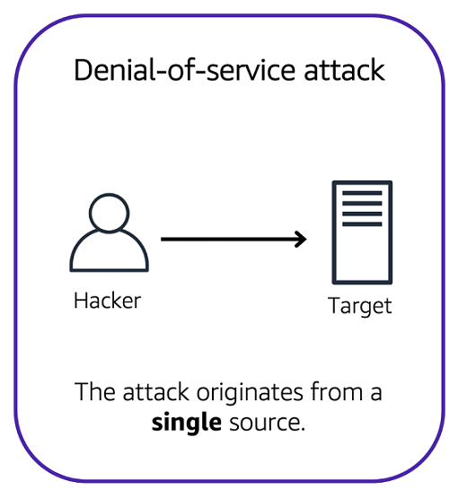

# AWS Cloud Practitioner Essentials

# Module 6: Security

## Modelo de Responsabilidad Compartida

**El modelo de responsabilidad compartida de AWS**

A lo largo de este curso, ha aprendido sobre una variedad de recursos que puede crear en la nube de AWS. Estos recursos incluyen instancias de Amazon EC2, buckets de Amazon S3 y bases de datos de Amazon RDS. ¿Quién es responsable de mantener estos recursos seguros: usted (el cliente) o AWS?

La respuesta es ambas. La razón es que no trata su entorno de AWS como un solo objeto. Más bien, tratas el medio ambiente como una colección de partes que se construyen unas sobre otras. AWS es responsable de algunas partes de su entorno y usted (el cliente) es responsable de otras partes. Este concepto se conoce como el [modelo de responsabilidad compartida](https://aws.amazon.com/es/compliance/shared-responsibility-model/).

El modelo de responsabilidad compartida se divide en responsabilidades del cliente (comúnmente conocidas como "seguridad en la nube") y responsabilidades de AWS (comúnmente conocidas como "seguridad de la nube").

Puede pensar que este modelo es similar a la división de responsabilidades entre un propietario y un constructor de viviendas. El constructor (AWS) es responsable de construir su casa y asegurarse de que esté sólidamente construida. Como propietario (el cliente), es su responsabilidad asegurar todo en la casa asegurándose de que las puertas estén cerradas y cerradas. 

**Clientes: Seguridad en la nube**

Los clientes son responsables de la seguridad de todo lo que crean y ponen en la nube de AWS.

Al utilizar los servicios de AWS, usted, el cliente, mantiene un control total sobre su contenido. Usted es responsable de administrar los requisitos de seguridad para su contenido, incluido el contenido que elija almacenar en AWS, los servicios de AWS que utilice y quién tenga acceso a ese contenido. También controla cómo se conceden, administran y revocan los derechos de acceso.

Los pasos de seguridad que tome dependerán de factores como los servicios que utilice, la complejidad de sus sistemas y las necesidades operativas y de seguridad específicas de su empresa. Los pasos incluyen seleccionar, configurar y aplicar parches a los sistemas operativos que se ejecutarán en instancias Amazon EC2, configurar grupos de seguridad y administrar cuentas de usuario. 

**AWS: Seguridad de la nube**

AWS es responsable de la seguridad de la nube.

AWS opera, administra y controla los componentes en todas las capas de la infraestructura. Esto incluye áreas como el sistema operativo host, la capa de virtualización e incluso la seguridad física de los centros de datos desde los que operan los servicios. 

AWS es responsable de proteger la infraestructura global que ejecuta todos los servicios ofrecidos en la nube de AWS. Esta infraestructura incluye regiones de AWS, zonas de disponibilidad y ubicaciones de borde. 

AWS administra la seguridad de la nube, específicamente la infraestructura física que aloja sus recursos, que incluyen:

- Seguridad física de los centros de datos
- Infraestructura de hardware y software
- Infraestructura de red
- Infraestructura de virtualización

Aunque no puede visitar los centros de datos de AWS para ver esta protección de primera mano, AWS proporciona varios informes de auditores externos. Estos auditores han verificado su cumplimiento con una variedad de estándares y regulaciones de seguridad informática.

## Permiso y acceso del usuario

**AWS Identity and Access Management (IAM)**

[AWS Identity and Access Management (IAM)](https://aws.amazon.com/es/iam/) le permite administrar el acceso a los servicios y recursos de AWS de forma segura. 

IAM le ofrece la flexibilidad de configurar el acceso en función de las necesidades operativas y de seguridad específicas de su empresa. Para ello, utilice una combinación de características de IAM, que se exploran en detalle en esta lección:

- Usuarios, grupos y roles de IAM
- Políticas de IAM
- Autenticación multifactor

También aprenderá las prácticas recomendadas para cada una de estas características.

**Usuario raíz de la cuenta de AWS**

Cuando crea una cuenta de AWS por primera vez, comienza con una identidad conocida como [usuario raíz](https://docs.aws.amazon.com/IAM/latest/UserGuide/id_root-user.html). 

Se accede al usuario raíz iniciando sesión con la dirección de correo electrónico y la contraseña que utilizó para crear su cuenta de AWS. Puede pensar que el usuario raíz es similar al propietario de la cafetería. Tiene acceso completo a todos los servicios y recursos de AWS de la cuenta.

**Prácticas recomendadas:**

**No** utilice el usuario root para las tareas cotidianas. 

En su lugar, utilice el usuario raíz para crear el primer usuario de IAM y asígnele permisos para crear otros usuarios.

A continuación, continúe creando otros usuarios de IAM y acceda a esas identidades para realizar tareas regulares en AWS. Utilice el usuario raíz únicamente cuando necesite realizar un número limitado de tareas que solo estén disponibles para el usuario raíz. Entre los ejemplos de estas tareas se incluyen cambiar la dirección de correo electrónico del usuario raíz y cambiar el plan de soporte de AWS.

**Usuarios de IAM**

Un **usuario de IAM** es una identidad que se crea en AWS. Representa a la persona o aplicación que interactúa con los servicios y recursos de AWS. Consiste en un nombre y credenciales.

De forma predeterminada, cuando crea un nuevo usuario de IAM en AWS, no tiene permisos asociados. Para permitir que el usuario de IAM realice acciones específicas en AWS, como lanzar una instancia Amazon EC2 o crear un bucket de Amazon S3, debe conceder al usuario de IAM los permisos necesarios.

**Prácticas recomendadas:**

Le recomendamos que cree usuarios de IAM individuales para cada persona que necesite obtener acceso a AWS. 

Incluso si tiene varios empleados que requieren el mismo nivel de acceso, debe crear usuarios de IAM individuales para cada uno de ellos. Esto proporciona seguridad adicional al permitir que cada usuario de IAM tenga un conjunto único de credenciales de seguridad.

**Políticas de IAM**

Una **política de IAM** es un documento que permite o deniega permisos a los servicios y recursos de AWS. 

Las políticas de IAM le permiten personalizar los niveles de acceso de los usuarios a los recursos. Por ejemplo, puede permitir que los usuarios accedan a todos los buckets de Amazon S3 dentro de su cuenta de AWS, o solo a un bucket específico.

**Prácticas recomendadas:**

Siga el principio de seguridad de **privilegios mínimos** al conceder permisos. 

Al seguir este principio, ayuda a evitar que los usuarios o roles tengan más permisos de los necesarios para realizar sus tareas. 

Por ejemplo, si un empleado solo necesita acceso a un bucket específico, especifique el bucket en la política de IAM. Haga esto en lugar de conceder al empleado acceso a todos los buckets de su cuenta de AWS.

**Ejemplo: política de IAM**

A continuación se muestra un ejemplo de cómo funcionan las políticas de IAM. Supongamos que el propietario de la cafetería tiene que crear un usuario de IAM para un cajero recién contratado. El cajero necesita acceso a los recibos guardados en un bucket de Amazon S3 con el ID: AWSDOC-EXAMPLE-BUCKET.

En este ejemplo, la política de IAM permite una acción específica dentro de Amazon S3: ListObject. La política también menciona un ID de bucket específico: AWSDOC-EXAMPLE-BUCKET. Cuando el propietario adjunta esta política al usuario de IAM del cajero, le permitirá ver todos los objetos del bucket AWSDOC-EXAMPLE-BUCKET. 

Si el propietario desea que el cajero pueda acceder a otros servicios y realizar otras acciones en AWS, el propietario debe adjuntar políticas adicionales para especificar estos servicios y acciones.

Ahora, supongamos que la cafetería ha contratado a algunos cajeros más. En lugar de asignar permisos a cada usuario individual de IAM, el propietario coloca a los usuarios en un [grupo de IAM](https://docs.aws.amazon.com/es_es/IAM/latest/UserGuide/id_groups.html).

**Grupos de IAM**

Un grupo de IAM es una colección de usuarios de IAM. Cuando se asigna una política de IAM a un grupo, se conceden a todos los usuarios del grupo los permisos especificados por la política.

Aquí hay un ejemplo de cómo esto podría funcionar en la cafetería. En lugar de asignar permisos a los cajeros de uno en uno, el propietario puede crear un grupo de IAM de "Cajeros". A continuación, el propietario puede agregar usuarios de IAM al grupo y, a continuación, adjuntar permisos en el nivel de grupo. 

La asignación de políticas de IAM a nivel de grupo también facilita el ajuste de permisos cuando un empleado se transfiere a un trabajo diferente. Por ejemplo, si un cajero se convierte en especialista en inventario, el propietario de la cafetería los elimina del grupo de IAM "Cajeros" y los agrega al grupo de IAM "Especialistas en inventario". Esto garantiza que los empleados solo tengan los permisos necesarios para su función actual.

¿Qué pasa si un empleado de una cafetería no ha cambiado de trabajo permanentemente, sino que rota a diferentes estaciones de trabajo a lo largo del día? Este empleado puede obtener el acceso que necesita a través de [los roles de IAM](https://docs.aws.amazon.com/es_es/IAM/latest/UserGuide/id_roles.html).

**IAM Roles**

En la cafetería, un empleado rota a diferentes estaciones de trabajo a lo largo del día. Dependiendo de la dotación de personal de la cafetería, este empleado puede realizar varias tareas: trabajar en la caja registradora, actualizar el sistema de inventario, procesar pedidos en línea, etc. 

Cuando el empleado necesita cambiar a una tarea diferente, renuncia a su acceso a una estación de trabajo y obtiene acceso a la siguiente estación de trabajo. El empleado puede cambiar fácilmente entre estaciones de trabajo, pero en cualquier momento dado, puede tener acceso a una sola estación de trabajo. Este mismo concepto existe en AWS con roles de IAM.

Un rol de IAM es una identidad que puede asumir para obtener acceso temporal a los permisos. 

Antes de que un usuario, aplicación o servicio de IAM pueda asumir un rol de IAM, se le deben conceder permisos para cambiar al rol. Cuando alguien asume un rol de IAM, abandona todos los permisos anteriores que tenía en un rol anterior y asume los permisos del nuevo rol. 

**Prácticas recomendadas:**

Los roles de IAM son ideales para situaciones en las que el acceso a servicios o recursos debe concederse temporalmente, en lugar de a largo plazo. 

**Ejemplo: Roles de IAM**

Revise un ejemplo de cómo se podrían usar los roles de IAM en la cafetería:

Primero, el propietario otorga al empleado permisos para cambiar a un rol para cada estación de trabajo en la cafetería.

A continuación, el empleado comienza su día asumiendo el rol de "Cajero". Esto les otorga acceso al sistema de caja registradora.

Más tarde en el día, el empleado necesita actualizar el sistema de inventario. Asumen el rol de "Inventario". Esto otorga al empleado acceso al sistema de inventario y también revoca su acceso al sistema de caja registradora.

**Autenticación multifactor**

¿Alguna vez ha iniciado sesión en un sitio web que requería que proporcionara múltiples piezas de información para verificar su identidad? Es posible que haya necesitado proporcionar su contraseña y luego una segunda forma de autenticación, como un código aleatorio enviado a su teléfono. Este es un ejemplo de [autenticación multifactor](https://aws.amazon.com/es/iam/features/mfa/).

En IAM, la autenticación multifactor (MFA) proporciona una capa adicional de seguridad para su cuenta de AWS.

1. En primer lugar, cuando un usuario inicia sesión en un sitio web de AWS, introduce su ID de usuario y contraseña de IAM. 

2. A continuación, se solicita al usuario una respuesta de autenticación desde su dispositivo AWS MFA. Este dispositivo podría ser una clave de seguridad de hardware, un dispositivo de hardware o una aplicación MFA en un dispositivo como un teléfono inteligente.

3. Cuando el usuario se ha autenticado correctamente, puede obtener acceso a los servicios o recursos de AWS solicitados.

Puede habilitar MFA para el usuario raíz y los usuarios de IAM. Como práctica recomendada, habilite MFA para el usuario raíz y todos los usuarios de IAM de su cuenta. Al hacer esto, puede mantener su cuenta de AWS a salvo del acceso no autorizado.

## Organizaciones de AWS

**Organizaciones de AWS**

Supongamos que su empresa tiene varias cuentas de AWS. Puede utilizar [AWS Organizations](https://aws.amazon.com/es/organizations/) para consolidar y administrar varias cuentas de AWS dentro de una ubicación central.

Al crear una organización, AWS Organizations crea automáticamente una raíz, que es el contenedor principal de todas las cuentas de la organización. 

En AWS Organizations, puede controlar de forma centralizada los permisos de las cuentas de su organización mediante [políticas de control de servicios (SCP)](https://docs.aws.amazon.com/es_es/organizations/latest/userguide/orgs_manage_policies_scps.html). Los SCP le permiten imponer restricciones a los servicios, recursos y acciones individuales de API de AWS a los que pueden acceder los usuarios y roles de cada cuenta.

La facturación consolidada es otra característica de AWS Organizations. Aprenderá sobre la facturación consolidada en un módulo posterior.

**Unidades Organizativas**

En AWS Organizations, puede agrupar cuentas en unidades organizativas (OU) para facilitar la administración de cuentas con requisitos empresariales o de seguridad similares. Cuando se aplica una directiva a una unidad organizativa, todas las cuentas de la unidad organizativa heredan automáticamente los permisos especificados en la directiva. 

Al organizar cuentas separadas en unidades organizativas, puede aislar más fácilmente las cargas de trabajo o las aplicaciones que tienen requisitos de seguridad específicos. Por ejemplo, si su empresa tiene cuentas que solo pueden acceder a los servicios de AWS que cumplen determinados requisitos normativos, puede colocar estas cuentas en una unidad organizativa. A continuación, puede adjuntar una política a la unidad organizativa que bloquee el acceso a todos los demás servicios de AWS que no cumplan los requisitos reglamentarios.

**Ejemplo: AWS Organizations**

Revise un ejemplo de cómo una empresa podría utilizar AWS Organizations:

Imagine que su empresa tiene cuentas de AWS separadas para los departamentos de finanzas, tecnología de la información (TI), recursos humanos (RRHH) y legales. Decide consolidar estas cuentas en una sola organización para poder administrarlas desde una ubicación central. Al crear la organización, esto establece la raíz.

Al diseñar su organización, tiene en cuenta las necesidades comerciales, de seguridad y regulatorias de cada departamento. Utilice esta información para decidir qué departamentos se agrupan en unidades organizativas.

Los departamentos de finanzas y TI tienen requisitos que no se superponen con los de ningún otro departamento. Estas cuentas se incorporan a su organización para aprovechar los beneficios, como la facturación consolidada, pero no las coloca en ninguna unidad organizativa.

Los departamentos de recursos humanos y legales deben obtener acceso a los mismos servicios y recursos de AWS, por lo que debe colocarlos juntos en una unidad organizativa. Colocarlos en una unidad organizativa le permite adjuntar políticas que se aplican a las cuentas de AWS de los departamentos de recursos humanos y legales.

Aunque haya colocado estas cuentas en unidades organizativas, puede seguir proporcionando acceso a usuarios, grupos y roles a través de IAM.

Al agrupar sus cuentas en unidades organizativas, puede darles acceso más fácilmente a los servicios y recursos que necesitan. También les impide acceder a cualquier servicio o recurso que no necesiten.

Está configurando políticas de control de servicios (SCP) en AWS Organizations. ¿A qué identidades y recursos se pueden aplicar los SCP? (Seleccione DOS.)

- [ ] Usuarios de IAM
- [ ] Grupos de IAM
- [x] Una cuenta de miembro individual
- [ ] Roles de IAM
- [x] Una unidad organizativa (OU)

## Comprobación de conocimientos

Las dos opciones de respuesta correctas son:

- **Una cuenta de miembro individual**
- **Una unidad organizativa (OU)**

En AWS Organizations, puede aplicar políticas de control de servicios (SCP) a la raíz de la organización, una cuenta de miembro individual o una unidad organizativa. Un SCP afecta a todos los usuarios, grupos y roles de IAM dentro de una cuenta, incluido el usuario raíz de la cuenta de AWS. 

Puede aplicar políticas de IAM a usuarios, grupos o roles de IAM. No puede aplicar una política de IAM al usuario raíz de la cuenta de AWS.

**Aprende más:**

- [Organizaciones de AWS](https://aws.amazon.com/es/organizations/)
- [Políticas de control de servicio](https://docs.aws.amazon.com/es_es/organizations/latest/userguide/orgs_manage_policies_scps.html)
- [Conexión de SCP](https://docs.aws.amazon.com/es_es/organizations/latest/userguide/orgs_manage_policies_scps_attach.html)

## Conformidad

**Artefacto de AWS**

Dependiendo de la industria de su empresa, es posible que deba mantener estándares específicos. Una auditoría o inspección asegurará que la compañía haya cumplido con esos estándares.

[AWS Artifact](https://aws.amazon.com/es/artifact/) es un servicio que proporciona acceso bajo demanda a informes de seguridad y conformidad de AWS y a acuerdos en línea seleccionados. AWS Artifact consta de dos secciones principales: Acuerdos de AWS Artifact e Informes de AWS Artifact.

**Acuerdos de AWS Artifact**

Supongamos que su empresa necesita firmar un acuerdo con AWS con respecto al uso de ciertos tipos de información en todos los servicios de AWS. Puede hacerlo a través de los acuerdos de AWS Artifact. 

En los acuerdos de AWS Artifact, puede revisar, aceptar y administrar acuerdos para una cuenta individual y para todas sus cuentas en AWS Organizations. Se ofrecen diferentes tipos de acuerdos para abordar las necesidades de los clientes que están sujetos a regulaciones específicas, como la Ley de Portabilidad y Responsabilidad del Seguro Médico (HIPAA).

**Informes de artefactos de AWS**

A continuación, supongamos que un miembro del equipo de desarrollo de su empresa está construyendo una aplicación y necesita más información sobre su responsabilidad de cumplir con ciertos estándares regulatorios. Puede aconsejarles que obtengan acceso a esta información en **AWS Artifact Reports**. 

AWS Artifact Reports proporciona informes de conformidad de auditores externos. Estos auditores han probado y verificado que AWS cumple con una variedad de estándares y regulaciones de seguridad globales, regionales y específicos de la industria. AWS Artifact Reports se mantiene actualizado con los informes más recientes publicados. Puede proporcionar los artefactos de auditoría de AWS a sus auditores o reguladores como prueba de los controles de seguridad de AWS. 

A continuación se presentan algunos de los informes y regulaciones de conformidad que puede encontrar en AWS Artifact. Cada informe incluye una descripción de su contenido y el período de presentación de informes durante el cual el documento es válido. 

## Ataques de denegación de servicio

Los clientes pueden llamar a la cafetería para realizar sus pedidos. Después de responder a cada llamada, un cajero toma el pedido y se lo da al barista. 

Sin embargo, supongamos que un bromista está llamando varias veces para hacer pedidos, pero nunca está recogiendo sus bebidas. Esto hace que el cajero no esté disponible para atender las llamadas de otros clientes. La cafetería puede intentar detener las solicitudes falsas bloqueando el número de teléfono que el bromista está utilizando. 

En este escenario, las acciones del bromista son similares a un **ataque de denegación de servicio**.

**Ataques de denegación de servicio**

Un **ataque de denegación de servicio (DoS)** es un intento deliberado de hacer que un sitio web o aplicación no esté disponible para los usuarios.

Por ejemplo, un atacante puede inundar un sitio web o una aplicación con tráfico de red excesivo hasta que el sitio web o la aplicación de destino se sobrecargue y ya no pueda responder. Si el sitio web o la aplicación dejan de estar disponibles, esto deniega el servicio a los usuarios que intentan realizar solicitudes legítimas.

**Ataques distribuidos de denegación de servicio**

Ahora, supongamos que el bromista ha solicitado la ayuda de amigos. 

El bromista y sus amigos llaman repetidamente a la cafetería con solicitudes para hacer pedidos, a pesar de que no tienen la intención de recogerlos. Estas solicitudes llegan desde diferentes números de teléfono, y es imposible que la cafetería las bloquee todas. Además, la afluencia de llamadas ha hecho que sea cada vez más difícil para los clientes poder recibir sus llamadas. Esto es similar a un **ataque distribuido de denegación de servicio**.

En un ataque distribuido de denegación de servicio (DDoS), se utilizan varias fuentes para iniciar un ataque que tiene como objetivo hacer que un sitio web o aplicación no esté disponible. Esto puede provenir de un grupo de atacantes, o incluso de un solo atacante. El atacante único puede usar múltiples computadoras infectadas (también conocidas como "bots") para enviar tráfico excesivo a un sitio web o aplicación.

Para ayudar a minimizar el efecto de los ataques DoS y DDoS en sus aplicaciones, puede utilizar [AWS Shield](https://aws.amazon.com/es/shield/).

**AWS Shield**

AWS Shield es un servicio que protege las aplicaciones contra ataques DDoS. AWS Shield proporciona dos niveles de protección: estándar y avanzado.

**Estándar de AWS Shield**

**AWS Shield Standard** protege automáticamente a todos los clientes de AWS sin costo alguno. Protege sus recursos de AWS de los tipos de ataques DDoS más comunes y frecuentes. 

A medida que el tráfico de red llega a sus aplicaciones, AWS Shield Standard utiliza una variedad de técnicas de análisis para detectar tráfico malicioso en tiempo real y lo mitiga automáticamente. 

**AWS Shield Avanzado**

**AWS Shield Advanced** es un servicio de pago que proporciona diagnósticos detallados de ataques y la capacidad de detectar y mitigar ataques DDoS sofisticados. 

También se integra con otros servicios como Amazon CloudFront, Amazon Route 53 y Elastic Load Balancing. Además, puede integrar AWS Shield con AWS WAF escribiendo reglas personalizadas para mitigar los ataques DDoS complejos.

## Servicios de seguridad adicionales

**Servicio de administración de claves de AWS (AWS KMS)**

La cafetería tiene muchos artículos, como máquinas de café, pasteles, dinero en las cajas registradoras, etc. Puede pensar en estos elementos como datos. Los propietarios de las cafeterías quieren asegurarse de que todos estos artículos estén seguros, ya sea que estén sentados en el trastero o siendo transportados entre las ubicaciones de las tiendas. 

De la misma manera, debe asegurarse de que los datos de sus aplicaciones estén seguros mientras están en almacenamiento (**cifrado en reposo**) y mientras se transmiten, lo que se conoce como **cifrado en tránsito**.

[AWS Key Management Service (AWS KMS)](https://aws.amazon.com/es/kms/) le permite realizar operaciones de cifrado mediante el uso de claves criptográficas. Una clave criptográfica es una cadena aleatoria de dígitos utilizada para bloquear (cifrar) y desbloquear (descifrar) datos. Puede utilizar AWS KMS para crear, administrar y utilizar claves criptográficas. También puede controlar el uso de claves en una amplia gama de servicios y en sus aplicaciones.

Con AWS KMS, puede elegir los niveles específicos de control de acceso que necesita para sus claves. Por ejemplo, puede especificar qué usuarios y roles de IAM pueden administrar claves. Alternativamente, puede deshabilitar temporalmente las claves para que ya no estén en uso por nadie. Sus claves nunca salen de AWS KMS y siempre tiene el control de ellas.

**AWS WAF**

[AWS WAF](https://aws.amazon.com/es/waf/) es un firewall de aplicaciones web que le permite supervisar las solicitudes de red que entran en sus aplicaciones web. 

AWS WAF funciona junto con Amazon CloudFront y un balanceador de carga de aplicaciones. Recuerde las listas de control de acceso a la red que aprendió en un módulo anterior. AWS WAF funciona de manera similar para bloquear o permitir el tráfico. Sin embargo, lo hace mediante el uso de una lista de control de acceso web (ACL) para proteger sus recursos de AWS. 

A continuación se muestra un ejemplo de cómo puede utilizar AWS WAF para permitir y bloquear solicitudes específicas.

## Summary 

Muy bien. Es hora de desglosar lo que acabamos de cubrir:

Lo primero es lo primero, AWS sigue un modelo de responsabilidad compartida. AWS es responsable de la seguridad de la nube y usted es responsable de la seguridad en la nube. 

Con IAM, tiene usuarios, grupos, roles y políticas. Los usuarios inician sesión con un nombre de usuario y una contraseña y, de forma predeterminada, no tienen permisos. Los grupos son agrupaciones de usuarios. Los roles son identidades que puede asumir para obtener acceso a credenciales y permisos temporales durante un período de tiempo configurable. Para conceder permisos a una identidad, debe crear políticas que permitan o denieguen explícitamente una acción específica en AWS. Con IAM también viene la federación de identidades. Si tiene un almacén de identidades corporativas existente, confederará a esos usuarios con AWS mediante el acceso basado en roles, lo que permite a los usuarios utilizar un inicio de sesión tanto para sus sistemas corporativos como para AWS. Un último punto a recordar sobre IAM es que debe asegurarse de activar la autenticación multifactor para los usuarios, pero especialmente para su usuario raíz, que tiene todos los permisos de forma predeterminada y no se puede restringir. 

A continuación, hablamos sobre las organizaciones de AWS. Con AWS, es probable que tenga varias cuentas. Las cuentas se usan comúnmente para aislar cargas de trabajo, entornos, equipos o aplicaciones. Aws Organizations le ayuda a administrar varias cuentas de forma jerárquica. 

Luego discutimos el cumplimiento. AWS utiliza auditores externos para demostrar su adhesión a una amplia variedad de programas de conformidad. Puede utilizar el Centro de conformidad de AWS para encontrar más información sobre la conformidad y AWS Artifact para obtener acceso a los documentos de conformidad. Los requisitos de cumplimiento que tenga variarán de una aplicación a otra y entre las áreas de operación. 

Luego hablamos sobre los ataques distribuidos de denegación de servicio o los ataques DDoS y cómo combatirlos con AWS utilizando herramientas como ELB, grupos de seguridad, AWS Shield y AWS WAF. 

También hablamos sobre el cifrado. En AWS, usted es el propietario de sus datos y es responsable de su seguridad. Eso significa que debe prestar atención al cifrado, en tránsito y en reposo. Hay muchos considerations cuando se trata de seguridad en AWS. La seguridad es la principal prioridad de AWS y seguirá siéndolo. 

Asegúrese de leer la documentación sobre la protección de sus recursos de AWS, ya que varía de un servicio a otro. Utilice el principio de privilegios mínimos al aplicar el alcance de los permisos para usuarios y roles en IAM, cifre sus datos en cada capa, tanto en tránsito como en reposo, y asegúrese de que ha utilizado los servicios de AWS para proteger su entorno.

## Quiz

1. ¿Qué declaración describe mejor una política de IAM?

- [ ] Un proceso de autenticación que proporciona una capa adicional de protección para su cuenta de AWS
- [x] Un documento que concede o deniega permisos a los servicios y recursos de AWS
- [ ] Una identidad que puede asumir para obtener acceso temporal a los permisos
- [ ] La identidad que se establece cuando crea una cuenta de AWS por primera vez

Las políticas de IAM le proporcionan la flexibilidad necesaria para personalizar los niveles de acceso de los usuarios a los recursos. Por ejemplo, puede permitir que los usuarios accedan a todos los buckets de Amazon S3 de su cuenta de AWS o solo a un bucket específico.

Las otras opciones de respuesta son incorrectas porque:

- La autenticación multifactor (MFA) es un proceso de autenticación que proporciona una capa adicional de protección para su cuenta de AWS.
- Un rol de IAM es una identidad que puede asumir para obtener acceso temporal a los permisos.
- La identidad de usuario raíz es la identidad que se establece cuando se crea una cuenta de AWS por primera vez.

**Aprende más:**

- [AWS IAM: Políticas y permisos](https://docs.aws.amazon.com/es_es/IAM/latest/UserGuide/access_policies.html)

2. Un empleado requiere acceso temporal para crear varios buckets de Amazon S3. ¿Qué opción sería la mejor opción para esta tarea?

- [ ] Usuario raíz de la cuenta de AWS
- [ ] Grupo IAM
- [x] Rol de IAM
- [ ] Política de control de servicio (SCP)

Un rol de IAM es una identidad que puede asumir para obtener acceso temporal a los permisos. Cuando alguien asume un rol de IAM, abandona todos los permisos que tenía en un rol anterior y asume los permisos del nuevo rol. Los roles de IAM son ideales para situaciones en las que el acceso a servicios o recursos debe concederse temporalmente en lugar de a largo plazo. 

Las otras opciones de respuesta son incorrectas porque:

- El usuario raíz de la cuenta de AWS se establece cuando crea una cuenta de AWS por primera vez. Como práctica recomendada, no utilice el usuario raíz para las tareas cotidianas.
- Aunque puede adjuntar políticas de IAM a un grupo de IAM, esta no sería la mejor opción para este escenario porque el empleado solo necesita que se le otorguen permisos temporales.
- Las directivas de control de servicio (SCP) le permiten controlar de forma centralizada los permisos de las cuentas de su organización. Un SCP no es la mejor opción para otorgar permisos temporales a un empleado individual.

**Aprende más:**

- [Roles de IAM](https://docs.aws.amazon.com/IAM/latest/UserGuide/id_roles.html)

3. ¿Qué afirmación describe mejor el principio del privilegio mínimo?

- [ ] Agregar un usuario de IAM a al menos un grupo de IAM
- [ ] Comprobación de los permisos de un paquete en una lista de control de acceso
- [x] Conceder solo los permisos necesarios para realizar tareas específicas
- [ ] Realizar un ataque de denegación de servicio que se origina en al menos un dispositivo

Cuando se conceden permisos siguiendo el principio de privilegios mínimos, se evita que los usuarios o roles tengan más permisos de los necesarios para realizar tareas de trabajo específicas. Por ejemplo, los cajeros de la cafetería deben tener acceso al sistema de caja registradora. Como práctica recomendada, conceda a los usuarios y roles de IAM un conjunto mínimo de permisos y, a continuación, conceda permisos adicionales según sea necesario. 

**Aprende más:**

- [Prácticas recomendadas de seguridad en IAM](https://docs.aws.amazon.com/es_es/IAM/latest/UserGuide/best-practices.html)

4. ¿Qué servicio ayuda a proteger sus aplicaciones contra ataques distribuidos de denegación de servicio (DDoS)?

- [ ] Amazon GuardDuty
- [ ] Amazon Inspector
- [ ] AWS Artifact
- [x] AWS Shield

A medida que el tráfico de red llega a sus aplicaciones, AWS Shield utiliza una variedad de técnicas de análisis para detectar posibles ataques DDoS en tiempo real y mitigarlos automáticamente.

Las otras opciones de respuesta son incorrectas porque:

- Amazon GuardDuty es un servicio que proporciona detección inteligente de amenazas para su infraestructura y recursos de AWS. Identifica las amenazas mediante la supervisión continua de la actividad de la red y el comportamiento de la cuenta dentro de su entorno de AWS.
- Amazon Inspector comprueba las aplicaciones en busca de vulnerabilidades de seguridad y desviaciones de las prácticas recomendadas de seguridad, como el acceso abierto a instancias amazon EC2 y las instalaciones de versiones de software vulnerables.
- AWS Artifact es un servicio que proporciona acceso bajo demanda a informes de seguridad y conformidad de AWS y a acuerdos en línea seleccionados.

**Aprende más:**

- [Escudo de AWS](https://aws.amazon.com/es/shield/)

5. ¿Qué tarea puede realizar AWS Key Management Service (AWS KMS)?

- [ ] Configure la autenticación multifactor (MFA).
- [ ] Actualice la contraseña de usuario raíz de la cuenta de AWS.
- [x] Crear claves criptográficas.
- [ ] Asigne permisos a usuarios y grupos.

AWS Key Management Service (AWS KMS) le permite realizar operaciones de cifrado mediante el uso de claves criptográficas. Una clave criptográfica es una cadena aleatoria de dígitos utilizada para bloquear (cifrar) y desbloquear (descifrar) datos. Puede utilizar AWS KMS para crear, administrar y utilizar claves criptográficas. También puede controlar el uso de claves en una amplia gama de servicios y en sus aplicaciones.

Las otras opciones de respuesta son incorrectas porque:

- Puede configurar la autenticación multifactor (MFA) en AWS Identity and Access Management (IAM).
- Puede actualizar la contraseña de usuario raíz de la cuenta de AWS en la consola de administración de AWS.
- Puede asignar permisos a usuarios y grupos en AWS Identity and Access Management (IAM).

**Aprende más:**

- [AWS KMS](https://aws.amazon.com/es/kms/)

# Module 6: Assesments and Resources

Para obtener más información sobre los conceptos que se exploraron en el Módulo 6, revise estos recursos.

- [Seguridad, identidad y conformidad en AWS](https://aws.amazon.com/es/products/security/)
- [Documento técnico: Introducción a la seguridad de AWS](https://docs.aws.amazon.com/es_es/whitepapers/latest/introduction-aws-security/welcome.html)
- [Documento técnico: Amazon Web Services - Descripción general de los procesos de seguridad](https://docs.aws.amazon.com/es_es/whitepapers/latest/aws-overview-security-processes/aws-overview-security-processes.pdf)
- [Blog de seguridad de AWS](https://aws.amazon.com/es/blogs/security/)
- [Conformidad con AWS](https://aws.amazon.com/es/compliance/)
- [Historias de clientes de AWS: seguridad, identidad y conformidad](https://aws.amazon.com/es/solutions/case-studies/?customer-references-cards.sort-by=item.additionalFields.publishedDate&customer-references-cards.sort-order=desc&awsf.customer-references-location=*all&awsf.customer-references-segment=*all&awsf.customer-references-product=product%23vpc%7Cproduct%23api-gateway%7Cproduct%23cloudfront%7Cproduct%23route53%7Cproduct%23directconnect%7Cproduct%23elb&awsf.customer-references-category=category%23security-identity-compliance)