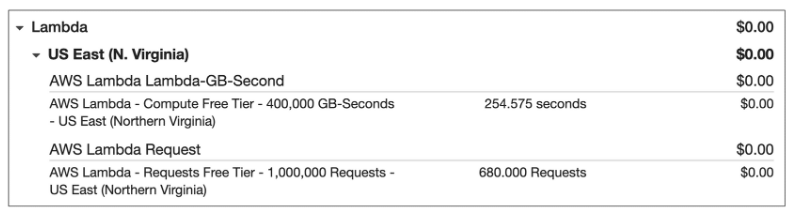
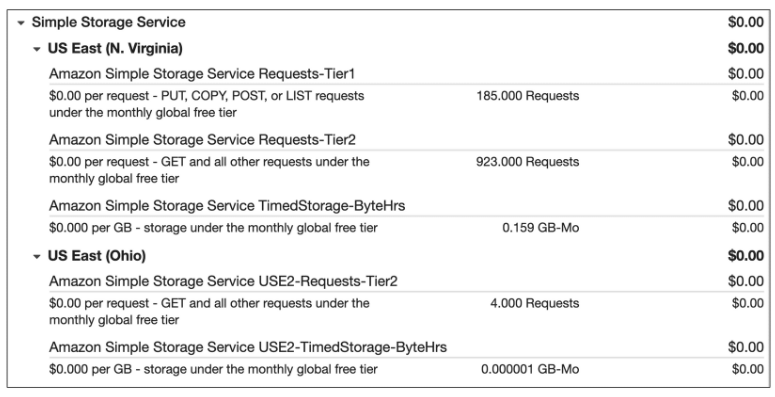

# AWS Cloud Practitioner Essentials

# Module 7: Monitoring and Analytics

## Amazon CloudWatch

**Amazon CloudWatch**

[Amazon CloudWatch](https://aws.amazon.com/cloudwatch/) es un servicio web que le permite supervisar y administrar varias métricas y configurar acciones de alarma basadas en los datos de esas métricas.

CloudWatch utiliza [métricas](https://docs.aws.amazon.com/es_es/AmazonCloudWatch/latest/monitoring/working_with_metrics.html) para representar los puntos de datos de sus recursos. Los servicios de AWS envían métricas a CloudWatch. A continuación, CloudWatch utiliza estas métricas para crear gráficos automáticamente que muestran cómo ha cambiado el rendimiento a lo largo del tiempo. 

**Alarmas de CloudWatch**

Con CloudWatch, puede crear [alarmas](https://docs.aws.amazon.com/es_es/AmazonCloudWatch/latest/monitoring/AlarmThatSendsEmail.html) que realicen acciones automáticamente si el valor de su métrica ha superado o superado un umbral predefinido. 

Por ejemplo, supongamos que los desarrolladores de su empresa utilizan instancias Amazon EC2 para fines de desarrollo o prueba de aplicaciones. Si los desarrolladores ocasionalmente olvidan detener las instancias, las instancias continuarán ejecutándose e incurrirán en cargos. 

En este escenario, podría crear una alarma de CloudWatch que detenga automáticamente una instancia Amazon EC2 cuando el porcentaje de utilización de la CPU se haya mantenido por debajo de un determinado umbral durante un período especificado. Al configurar la alarma, puede especificar recibir una notificación cada vez que se active esta alarma.

**Panel de cloudWatch**

La función del [panel de CloudWatch](https://docs.aws.amazon.com/es_es/AmazonCloudWatch/latest/monitoring/CloudWatch_Dashboards.html) le permite acceder a todas las métricas de sus recursos desde una única ubicación. Por ejemplo, puede utilizar un panel de CloudWatch para supervisar la utilización de la CPU de una instancia Amazon EC2, el número total de solicitudes realizadas a un bucket de Amazon S3 y mucho más. Incluso puede personalizar paneles separados para diferentes propósitos comerciales, aplicaciones o recursos.

## AWS CloudTrail

**AWS CloudTrail**

[AWS CloudTrail](https://aws.amazon.com/cloudtrail/) registra las llamadas a la API de su cuenta. La información registrada incluye la identidad del llamador de la API, la hora de la llamada a la API, la dirección IP de origen del llamador de la API y más. Puede pensar en CloudTrail como un "rastro" de migas de pan (o un registro de acciones) que alguien ha dejado atrás.

Recuerde que puede utilizar las llamadas a la API para aprovisionar, administrar y configurar sus recursos de AWS. Con CloudTrail, puede ver un historial completo de la actividad del usuario y las llamadas a la API para sus aplicaciones y recursos. 

Normalmente, los eventos se actualizan en CloudTrail en un plazo de 15 minutos después de una llamada a la API. Puede filtrar eventos especificando la hora y la fecha en que se produjo una llamada a la API, el usuario que solicitó la acción, el tipo de recurso que participó en la llamada a la API y mucho más.

**Ejemplo: evento de AWS CloudTrail**

Supongamos que el propietario de la cafetería está navegando por la sección AWS Identity and Access Management (IAM) de la consola de administración de AWS. Descubren que se creó un nuevo usuario de IAM llamado Mary, pero no lo hacen quién, cuándo o qué método creó el usuario.

Para responder a estas preguntas, el propietario navega a AWS CloudTrail.

En la sección Historial de eventos de CloudTrail, el propietario aplica un filtro para mostrar solo los eventos de la acción de la API "CreateUser" en IAM. El propietario localiza el evento para la llamada a la API que creó un usuario de IAM para Mary. Este registro de eventos proporciona detalles completos sobre lo que ocurrió: 

El 1 de enero de 2020 a las 9:00 AM, el usuario de IAM John creó un nuevo usuario de IAM (Mary) a través de la consola de administración de AWS.

**Información de CloudTrail**

Dentro de CloudTrail, también puede habilitar [CloudTrail Insights](https://docs.aws.amazon.com/es_es/awscloudtrail/latest/userguide/logging-insights-events-with-cloudtrail.html). Esta característica opcional permite a CloudTrail detectar automáticamente actividades de API inusuales en su cuenta de AWS. 

Por ejemplo, CloudTrail Insights podría detectar que un número de instancias Amazon EC2 superior al habitual se ha lanzado recientemente en su cuenta. A continuación, puede revisar los detalles completos del evento para determinar qué acciones debe realizar a continuación.

## Asesor de confianza de AWS

**Asesor de confianza de AWS**

[AWS Trusted Advisor](https://aws.amazon.com/es/premiumsupport/technology/trusted-advisor/) es un servicio web que inspecciona su entorno de AWS y proporciona recomendaciones en tiempo real de acuerdo con las prácticas recomendadas de AWS.

Trusted Advisor compara sus hallazgos con las prácticas recomendadas de AWS en cinco categorías: optimización de costos, rendimiento, seguridad, tolerancia a errores y límites de servicio. Para las comprobaciones en cada categoría, Trusted Advisor ofrece una lista de acciones recomendadas y recursos adicionales para obtener más información sobre las prácticas recomendadas de AWS. 

La orientación proporcionada por AWS Trusted Advisor puede beneficiar a su empresa en todas las etapas de la implementación. Por ejemplo, puede utilizar AWS Trusted Advisor para que le ayude a crear nuevos flujos de trabajo y desarrollar nuevas aplicaciones. O puede usarlo mientras realiza mejoras continuas en las aplicaciones y recursos existentes.

**Panel de AWS Trusted Advisor**

Cuando accede al panel de Trusted Advisor en la consola de administración de AWS, puede revisar las comprobaciones completadas para la optimización de costos, el rendimiento, la seguridad, la tolerancia a errores y los límites de servicio.

Para cada categoría:

- La comprobación verde indica el número de elementos para los que no detectó **problemas**.
- El triángulo naranja representa el número de **investigaciones recomendadas**.
- El círculo rojo representa el número de **acciones recomendadas**.

## Módulo 7 Quiz

1. ¿Qué acciones puede realizar con Amazon CloudWatch? Seleccione DOS.

- [x] Supervise la utilización y el rendimiento de sus recursos
- [ ] Reciba orientación en tiempo real para mejorar su entorno de AWS
- [ ] Compare su infraestructura con las prácticas recomendadas de AWS en cinco categorías
- [x] Acceda a las métricas desde un único panel

Las otras opciones de respuesta son incorrectas porque:

- AWS Trusted Advisor puede realizar la recepción de recomendaciones en tiempo real para mejorar su entorno de AWS.
- AWS Trusted Advisor puede comparar su infraestructura con las prácticas recomendadas de AWS en cinco categorías.
- AWS CloudTrail puede detectar automáticamente la actividad inusual de la cuenta.

**Aprende más:**

- [Amazon CloudWatch](https://aws.amazon.com/es/cloudwatch/)

2. ¿Qué servicio le permite revisar la seguridad de sus buckets de Amazon S3 mediante la comprobación de permisos de acceso abierto?

- [ ] Amazon CloudWatch
- [ ] AWS CloudTrail
- [x] Asesor de confianza de AWS (AWS Trusted Advisor)
- [ ] Amazon GuardDuty

AWS Trusted Advisor es un servicio web que inspecciona su entorno de AWS y proporciona recomendaciones en tiempo real de acuerdo con las prácticas recomendadas de AWS. La inspección incluye comprobaciones de seguridad, como buckets de Amazon S3 con permisos de acceso abierto.

Las otras opciones de respuesta son incorrectas porque:

- Amazon CloudWatch es un servicio web que le permite supervisar y administrar varias métricas para los recursos que ejecutan sus aplicaciones.
- AWS CloudTrail es un servicio web que le permite revisar los detalles de las actividades de los usuarios y las llamadas a la API que se han producido en su entorno de AWS.
- Amazon GuardDuty es un servicio que proporciona detección inteligente de amenazas para su entorno y recursos de AWS. Identifica las amenazas mediante la supervisión continua de la actividad de la red y el comportamiento de la cuenta dentro de su entorno de AWS.

**Aprende más:**

- [Asesor de confianza de AWS](https://aws.amazon.com/es/premiumsupport/technology/trusted-advisor/)

3. ¿Qué categorías se incluyen en el panel de AWS Trusted Advisor? Seleccione DOS.

- [ ] Fiabilidad
- [x] Rendimiento
- [ ] Escalabilidad
- [ ] Elasticidad
- [x] Tolerancia a fallos

AWS Trusted Advisor inspecciona continuamente su entorno de AWS y proporciona recomendaciones de prácticas recomendadas en cinco categorías: optimización de costos, rendimiento, seguridad, tolerancia a errores y límites de servicio. 

**Aprende más:**

- [Asesor de confianza de AWS](https://aws.amazon.com/es/premiumsupport/technology/trusted-advisor/)

## Recursos

Para obtener más información sobre los conceptos que se exploraron en el Módulo 7, revise estos recursos.

- [Administración y gobierno en AWS](https://aws.amazon.com/es/products/management-tools/)
- [Monitoreo y Observabilidad](https://aws.amazon.com/es/products/management-and-governance/use-cases/monitoring-and-observability/)
- [Configuración, cumplimiento y auditoría](https://aws.amazon.com/es/products/management-and-governance/use-cases/configuration-compliance-and-auditing/)
- [Blog de administración y gobernanza de AWS](https://aws.amazon.com/es/blogs/mt/)
- [Documento técnico: Gobernanza de AWS a escala](https://docs.aws.amazon.com/es_es/whitepapers/latest/aws-governance-at-scale/aws-governance-at-scale.html)
- [Documentos técnicos y guías de AWS](https://aws.amazon.com/whitepapers/)

# Module 8: Pricing and Support

## Capa gratuita de AWS

**Capa gratuita de AWS**

La [capa gratuita](https://aws.amazon.com/es/free/) de AWS le permite comenzar a utilizar determinados servicios sin tener que preocuparse por incurrir en costos durante el período especificado. 

Hay tres tipos de ofertas disponibles: 

- Siempre gratis
- 12 meses gratis
- Ensayos

Para cada oferta de nivel gratuito, asegúrese de revisar los detalles específicos sobre exactamente qué tipos de recursos se incluyen. 

**Siempre gratis**

Estas ofertas no caducan y están disponibles para todos los clientes de AWS.

Por ejemplo, AWS Lambda permite 1 millón de solicitudes gratuitas y hasta 3,2 millones de segundos de tiempo de cómputo al mes. Amazon DynamoDB permite 25 GB de almacenamiento gratuito al mes.

**12 meses gratis**

Estas ofertas son gratuitas durante 12 meses a partir de la fecha de registro inicial en AWS.

Los ejemplos incluyen cantidades específicas de almacenamiento estándar de Amazon S3, umbrales para las horas mensuales de tiempo de cómputo de Amazon EC2 y cantidades de transferencia de datos de Amazon CloudFront.

**Ensayos**

Las ofertas de prueba gratuita a corto plazo comienzan a partir de la fecha en que activa un servicio en particular. La duración de cada prueba puede variar según el número de días o la cantidad de uso en el servicio.

Por ejemplo, Amazon Inspector ofrece una prueba gratuita de 90 días. Amazon Lightsail (un servicio que le permite ejecutar servidores privados virtuales) ofrece 750 horas gratuitas de uso durante un período de 30 días.

## Conceptos de precios de AWS

**Cómo funcionan los precios de AWS**

AWS ofrece una gama de servicios de computación en la nube con precios de pago por uso. 

**Paga por lo que usas.**

Por cada servicio, usted paga exactamente por la cantidad de recursos que realmente utiliza, sin requerir contratos a largo plazo o licencias complejas. 

**Paga menos al reservar.**

Algunos servicios ofrecen opciones de reserva que proporcionan un descuento significativo en comparación con los precios de la instancia bajo demanda.

Por ejemplo, supongamos que su empresa utiliza instancias Amazon EC2 para una carga de trabajo que debe ejecutarse continuamente. Puede optar por ejecutar esta carga de trabajo en los planes de ahorro de instancias Amazon EC2, ya que el plan le permite ahorrar hasta un 72 % sobre la capacidad equivalente de instancias bajo demanda.

**Pague menos con descuentos basados en el volumen cuando use más.**

Algunos servicios ofrecen precios escalonados, por lo que el costo por unidad es incrementalmente menor con un mayor uso.

Por ejemplo, cuanto más espacio de almacenamiento de Amazon S3 utilice, menos pagará por él por GB.

**Calculadora de precios de AWS**

La [calculadora de precios de AWS](https://calculator.aws/#/) le permite explorar los servicios de AWS y crear una estimación del costo de sus casos de uso en AWS. Puede organizar las estimaciones de AWS por grupos que defina. Un grupo puede reflejar cómo está organizada su empresa, como proporcionar estimaciones por centro de costos.

Cuando haya creado una estimación, puede guardarla y generar un enlace para compartirla con otros.

Supongamos que su empresa está interesada en utilizar Amazon EC2. Sin embargo, aún no está seguro de qué región o tipo de instancia de AWS sería la más rentable para su caso de uso. En la calculadora de precios de AWS, puede introducir detalles como el tipo de sistema operativo que necesita, los requisitos de memoria y los requisitos de entrada/salida (E/S). Mediante la calculadora de precios de AWS, puede revisar una comparación estimada de diferentes tipos de instancias EC2 entre regiones de AWS.

**Ejemplos de precios de AWS**

En esta sección se presentan algunos ejemplos de precios en los servicios de AWS. 

**Precios de AWS Lambda**

En el caso de AWS Lambda, se le cobrará en función del número de solicitudes de funciones y del tiempo que tarden en ejecutarse.

AWS Lambda permite 1 millón de solicitudes gratuitas y hasta 3,2 millones de segundos de tiempo de cómputo al mes.

Puede ahorrar en costos de AWS Lambda registrándose en un plan de ahorro informático. Un plan de ahorro de cómputo ofrece costos de cómputo más bajos a cambio de comprometerse con una cantidad constante de uso durante un período de 1 año o 3 años. Este es un ejemplo de **pagar menos cuando reservas**. 

**Ejemplo de precios de AWS Lambda**

Si ha utilizado AWS Lambda en varias regiones de AWS, puede ver los cargos detallados por región en su factura. 

En este ejemplo, todo el uso de AWS Lambda se produjo en la región norte de Virginia. El proyecto de ley enumera cargos separados por el número de solicitudes de funciones y su duración. 

Tanto el número de solicitudes como la duración total de las solicitudes en este ejemplo están por debajo de los umbrales de la capa gratuita de AWS, por lo que el propietario de la cuenta no tendría que pagar por ningún uso de AWS Lambda en este mes.

**Precios de Amazon EC2**

Con Amazon EC2, solo paga por el tiempo de cómputo que utiliza mientras se ejecutan las instancias.

Para algunas cargas de trabajo, puede reducir significativamente los costos de Amazon EC2 mediante el uso de instancias de spot. Por ejemplo, supongamos que está ejecutando un trabajo de procesamiento por lotes que es capaz de soportar interrupciones. El uso de una instancia de spot le proporcionaría hasta un 90 % de ahorro de costes y, al mismo tiempo, cumpliría con los requisitos de disponibilidad de su carga de trabajo.

Puede encontrar ahorros de costos adicionales para Amazon EC2 considerando los planes de ahorro y las instancias reservadas.

**Ejemplo de precios de Amazon EC2**

Los cargos por servicio de este ejemplo incluyen detalles para los siguientes elementos:

- Cada tipo de instancia Amazon EC2 que se ha utilizado
- La cantidad de espacio de almacenamiento de Amazon EBS que se ha aprovisionado
- El tiempo que se ha utilizado Elastic Load Balancing

En este ejemplo, todos los importes de uso están por debajo de los umbrales de la capa gratuita de AWS, por lo que el propietario de la cuenta no tendría que pagar por ningún uso de Amazon EC2 en este mes.

## Precios de Amazon S3

Para conocer los precios de Amazon S3, tenga en cuenta los siguientes componentes de costo:

- **Almacenamiento** -  Usted paga solo por el almacenamiento que utiliza. Se le cobrará la tarifa para almacenar objetos en sus buckets de Amazon S3 en función de los tamaños de sus objetos, las clases de almacenamiento y el tiempo que haya almacenado cada objeto durante el mes.

- **Solicitudes y recuperación de datos** -  Usted paga por las solicitudes realizadas a sus objetos y buckets de Amazon S3. Por ejemplo, supongamos que almacena archivos de fotos en buckets de Amazon S3 y los aloja en un sitio web. Cada vez que un visitante solicita el sitio web que incluye estos archivos de fotos, esto cuenta para las solicitudes que debe pagar.

- **Transferencia de datos** -  La transferencia de datos entre diferentes buckets de Amazon S3 o de Amazon S3 a otros servicios dentro de la misma región de AWS no tiene ningún costo. Sin embargo, paga por los datos que transfiere dentro y fuera de Amazon S3, con algunas excepciones. Los datos transferidos a Amazon S3 desde Internet o a Amazon CloudFront no tienen ningún costo. Tampoco hay ningún costo por los datos transferidos a una instancia Amazon EC2 en la misma región de AWS que el bucket de Amazon S3.

- **Administración y replicación**: Usted paga por las características de administración de almacenamiento que ha habilitado en los buckets de Amazon S3 de su cuenta. Estas características incluyen inventario de Amazon S3, análisis y etiquetado de objetos.

**Ejemplo de precios de Amazon S3**

La cuenta de AWS de este ejemplo ha utilizado Amazon S3 en dos regiones: Virginia del Norte y Ohio. Para cada región, los cargos detallados se basan en los siguientes factores:

El número de solicitudes para agregar o copiar objetos en un bucket

El número de solicitudes para recuperar objetos de un bucket

La cantidad de espacio de almacenamiento utilizado

Todo el uso de Amazon S3 en este ejemplo está por debajo de los límites de la capa gratuita de AWS, por lo que el propietario de la cuenta no tendría que pagar por ningún uso de Amazon S3 en este mes.

## Panel de facturación

Utilice el panel de [AWS Billing & Cost Management](https://docs.aws.amazon.com/es_es/awsaccountbilling/latest/aboutv2/billing-what-is.html) para pagar su factura de AWS, supervisar su uso y analizar y controlar sus costes.

- Compare su saldo actual del mes hasta la fecha con el mes anterior y obtenga un pronóstico del próximo mes basado en el uso actual.
- Vea el gasto del mes hasta la fecha por servicio.
- Ver el uso de la capa gratuita por servicio.
- Acceda al Explorador de costos y cree presupuestos.
- Compra y gestión de Planes de Ahorro.
- Publique [informes de costos y uso de AWS](https://docs.aws.amazon.com/es_es/cur/latest/userguide/what-is-cur.html).

## Facturación consolidada

En un módulo anterior, aprendió sobre AWS Organizations, un servicio que le permite administrar varias cuentas de AWS desde una ubicación central. AWS Organizations también ofrece la opción de [facturación consolidada](https://docs.aws.amazon.com/awsaccountbilling/latest/aboutv2/consolidated-billing.html). 

La característica de facturación consolidada de AWS Organizations le permite recibir una sola factura para todas las cuentas de AWS de su organización. Al consolidar, puede realizar un seguimiento fácil de los costos combinados de todas las cuentas vinculadas en su organización. El número máximo predeterminado de cuentas permitidas para una organización es 4, pero puede ponerse en contacto con AWS Support para aumentar su cuota, si es necesario.

En su factura mensual, puede revisar los cargos detallados incurridos por cada cuenta. Esto le permite tener una mayor transparencia en las cuentas de su organización al tiempo que mantiene la conveniencia de recibir una sola factura mensual.

Otro beneficio de la facturación consolidada es la capacidad de compartir precios de descuento por volumen, planes de ahorro e instancias reservadas en todas las cuentas de su organización. Por ejemplo, es posible que una cuenta no tenga suficiente uso mensual para calificar para los precios de descuento. Sin embargo, cuando se combinan varias cuentas, su uso agregado puede resultar en un beneficio que se aplica a todas las cuentas de la organización.

**Ejemplo: Facturación consolidada**

Supongamos que usted es el líder empresarial que supervisa la facturación de AWS de su empresa. 

Su empresa tiene tres cuentas de AWS utilizadas para departamentos independientes. En lugar de pagar la factura mensual de cada ubicación por separado, decide crear una organización y agregar las tres cuentas. 

La organización se administra a través de la cuenta principal.

Cada mes, AWS cobra a su cuenta de pagador principal todas las cuentas vinculadas en una factura consolidada. A través de la cuenta principal, también puede obtener un informe de costos detallado para cada cuenta vinculada. 

La factura consolidada mensual también incluye los costos de uso de la cuenta incurridos por la cuenta principal. Este costo no es un cargo premium por tener una cuenta principal. 

La factura consolidada muestra los costos asociados con cualquier acción de la cuenta principal (como almacenar archivos en Amazon S3 o ejecutar instancias Amazon EC2).

La facturación consolidada también le permite compartir descuentos en precios por volumen entre cuentas. 

Algunos servicios de AWS, como Amazon S3, ofrecen descuentos en los precios por volumen que le ofrecen precios más bajos cuanto más utilice el servicio. En Amazon S3, después de que los clientes hayan transferido 10 TB de datos en un mes, pagan un precio de transferencia por GB más bajo por los próximos 40 TB de datos transferidos. 

En este ejemplo, hay tres cuentas de AWS independientes que han transferido diferentes cantidades de datos en Amazon S3 durante el mes actual: 

- La cuenta 1 ha transferido 2 TB de datos.
- La cuenta 2 ha transferido 5 TB de datos.
- La cuenta 3 ha transferido 7 TB de datos.

Debido a que ninguna cuenta ha superado el umbral de 10 TB, ninguna de ellas es elegible para el precio de transferencia por GB más bajo para los próximos 40 TB de datos transferidos.

Ahora, supongamos que estas tres cuentas independientes se unen como cuentas vinculadas dentro de una sola organización de AWS y utilizan la facturación consolidada.

Cuando se combina el uso de Amazon S3 para las tres cuentas vinculadas (2+5+7), esto da como resultado una cantidad combinada de transferencia de datos de 14 TB. Esto supera el umbral de 10 TB. 

Con la facturación consolidada, AWS combina el uso de todas las cuentas para determinar qué niveles de precios por volumen aplicar, lo que le ofrece un precio general más bajo siempre que sea posible. A continuación, AWS asigna a cada cuenta vinculada una parte del descuento por volumen general en función del uso de la cuenta. 

En este ejemplo, la Cuenta 3 recibiría una mayor parte del descuento por volumen total porque, con 7 TB, ha transferido más datos que la Cuenta 1 (con 2 TB) y la Cuenta 2 (con 5 TB).

## Presupuestos de AWS

**Presupuestos de AWS**

En [AWS Budgets](https://aws.amazon.com/es/aws-cost-management/aws-budgets/), puede crear presupuestos para planificar el uso del servicio, los costos del servicio y las reservas de instancias.

La información de AWS Budgets se actualiza tres veces al día. Esto le ayuda a determinar con precisión qué tan cerca está su uso de sus cantidades presupuestadas o de los límites de la capa gratuita de AWS.

En AWS Budgets, también puede establecer alertas personalizadas cuando su uso exceda (o se prevea que excederá) la cantidad presupuestada.

**Ejemplo: Presupuestos de AWS**

Supongamos que ha establecido un presupuesto para Amazon EC2. Desea asegurarse de que el uso de Amazon EC2 por parte de su empresa no supere los 200 USD del mes. 

En AWS Budgets, puede establecer un presupuesto personalizado para notificarle cuando su uso haya alcanzado la mitad de esta cantidad ($ 100). Esta configuración le permitiría recibir una alerta y decidir cómo desea continuar con el uso continuado de Amazon EC2.

En este presupuesto de ejemplo, puede revisar los siguientes detalles importantes:

- La cantidad actual en la que ha incurrido para Amazon EC2 en lo que va del mes (136,90 USD)
- La cantidad que se pronostica que gastará para el mes ($ 195.21), según sus patrones de uso.

También puede revisar las comparaciones de su uso actual frente al presupuestado y el uso previsto frente al presupuestado. 

Por ejemplo, en la fila superior de este presupuesto de muestra, la barra pronosticada frente a la presupuestada está en 125.17%. La razón del aumento es que la cantidad prevista (56,33 dólares) supera la cantidad que se había presupuestado para esa partida para el mes (45,00 dólares). 

## Explorador de costos de AWS

**Explorador de costos de AWS**

[AWS Cost Explorer](https://aws.amazon.com/es/aws-cost-management/aws-cost-explorer/) es una herramienta que le permite visualizar, comprender y administrar los costos y el uso de AWS a lo largo del tiempo.

AWS Cost Explorer incluye un informe predeterminado de los costos y el uso de sus cinco principales servicios de AWS que acumulan costos. Puede aplicar filtros y grupos personalizados para analizar los datos. Por ejemplo, puede ver el uso de recursos por hora.

**Ejemplo: AWS Cost Explorer**

Este ejemplo del panel de AWS Cost Explorer muestra los costos mensuales de las instancias Amazon EC2 durante un período de 6 meses. La barra de cada mes separa los costos de los distintos tipos de instancias Amazon EC2 (como t2.micro o m3.large).

Al analizar sus costos de AWS a lo largo del tiempo, puede tomar decisiones informadas sobre los costos futuros y cómo planificar sus presupuestos.

## Planes de AWS Support

**Soporte de AWS**

AWS ofrece cuatro [planes de soporte](https://aws.amazon.com/es/premiumsupport/plans/) diferentes para ayudarle a solucionar problemas, reducir los costos y utilizar los servicios de AWS de manera eficiente.

Puede elegir entre los siguientes planes de soporte para satisfacer las necesidades de su empresa:

- Básico
- Desarrollador
- Negocio
- Rampa de acceso empresarial
- Empresa

**Soporte básico**

**El soporte básico** es gratuito para todos los clientes de AWS. Incluye acceso a documentos técnicos, documentación y comunidades de soporte. Con Basic Support, también puede ponerse en contacto con AWS si tiene preguntas sobre facturación y aumentos del límite de servicio.

Con Basic Support, tiene acceso a una selección limitada de comprobaciones de AWS Trusted Advisor. Además, puede utilizar **AWS Personal Health Dashboard**, una herramienta que proporciona alertas y orientación de corrección cuando AWS experimenta eventos que pueden afectarle.

Si su empresa necesita soporte más allá del nivel básico, podría considerar comprar soporte para desarrolladores, empresas, rampas de acceso empresarial o soporte empresarial.

**Desarrollador, Negocios, Rampa de acceso empresarial y soporte empresarial**

Los planes Developer, Business, Enterprise On-Ramp y Enterprise Support incluyen todos los beneficios del soporte básico, además de la capacidad de abrir un número ilimitado de casos de soporte técnico. Estos tres planes de soporte tienen precios de pago por mes y no requieren contratos a largo plazo.

La información de este curso destaca solo una selección de detalles para cada plan de soporte. En el sitio de [AWS Support](https://aws.amazon.com/es/premiumsupport/plans/) encontrará una descripción general completa de lo que se incluye en cada plan de soporte, incluidos los precios de cada plan.

En general, para los precios, el plan Developer tiene el costo más bajo, los planes Business y Enterprise On-Ramp están en el medio, y el plan Enterprise tiene el costo más alto.

**Soporte para desarrolladores**

Los clientes del plande soporte para desarrolladorestienen acceso a funciones como:

- Guía de mejores prácticas
- Herramientas de diagnóstico del lado del cliente
- Compatibilidad con la arquitectura de bloques de creación, que consiste en orientación sobre cómo utilizar las ofertas, características y servicios de AWS juntos

Por ejemplo, supongamos que su empresa está explorando los servicios de AWS. Ha oído hablar de algunos servicios de AWS diferentes. Sin embargo, no está seguro de cómo usarlos potencialmente juntos para crear aplicaciones que puedan satisfacer las necesidades de su empresa. En este escenario, la compatibilidad con la arquitectura de bloques de creación que se incluye con el plan de soporte técnico para desarrolladores podría ayudarle a identificar oportunidades para combinar servicios y características específicos.

**Soporte Empresarial**

Los clientes con un plan **Business Support** tienen acceso a funciones adicionales, que incluyen:

- Guía de casos de uso para identificar las ofertas, características y servicios de AWS que mejor se adapten a sus necesidades específicas
- Todas las comprobaciones de AWS Trusted Advisor
- Soporte limitado para software de terceros, como sistemas operativos comunes y componentes de pila de aplicaciones

Supongamos que su empresa tiene el plan Business Support y desea instalar un sistema operativo común de terceros en sus instancias Amazon EC2. Puede ponerse en contacto con AWS Support para obtener ayuda con la instalación, configuración y solución de problemas del sistema operativo. Para temas avanzados, como la optimización del rendimiento, el uso de scripts personalizados o la resolución de problemas de seguridad, es posible que deba ponerse en contacto directamente con el proveedor de software de terceros.

**Soporte de rampa para empresas**

En noviembre de 2021, AWS abrió la inscripción en el plan AWS Enterprise On-Ramp Support. Además de todas las características incluidas en los planes Basic, Developer y Business Support, los clientes con un plan Enterprise On-Ramp Support tienen acceso a:

- Un grupo de administradores técnicos de cuentas para proporcionar orientación proactiva y coordinar el acceso a programas y expertos de AWS
- Un taller de optimización de costos (uno por año)
- Un equipo de soporte de Concierge para facturación y asistencia con la cuenta
- Herramientas para supervisar los costes y el rendimiento a través de Trusted Advisor y Health API/Dashboard

El plan Enterprise On-Ramp Support también proporciona acceso a un conjunto específico de servicios de soporte proactivo, que son proporcionados por un grupo de administradores técnicos de cuentas.

- Revisión consultiva y orientación sobre la arquitectura (una por año)
- Soporte de gestión de eventos de infraestructura (uno por año)
- Compatibilidad con flujos de trabajo de automatización
- Tiempo de respuesta de 30 minutos o menos para problemas críticos para el negocio

**Soporte para empresas**

Además de todas las características incluidas en los planes de soporte técnico Basic, Developer, Business y Enterprise On-Ramp, los clientes con Enterprise Support tienen acceso a:

- Un administrador técnico de cuentas designado para proporcionar orientación proactiva y coordinar el acceso a programas y expertos de AWS
- Un equipo de soporte de Concierge para facturación y asistencia con la cuenta
- Revisiones de operaciones y herramientas para supervisar el estado
- Jornadas de formación y juego para impulsar la innovación
- Herramientas para supervisar los costes y el rendimiento a través de Trusted Advisor y Health API/Dashboard

El plan Enterprise también proporciona acceso completo a servicios proactivos, que son proporcionados por un administrador técnico de cuentas designado:

- Examen consultivo y orientación sobre la arquitectura
- Soporte de gestión de eventos de infraestructura
- Taller de optimización de costos y herramientas
- Compatibilidad con flujos de trabajo de automatización
- Tiempo de respuesta de 15 minutos o menos para problemas críticos para el negocio

**Gerente Técnico de Cuentas (TAM)**

Los planes Enterprise On-Ramp y Enterprise Support incluyen acceso a un **administrador técnico de cuentas (TAM)**.

El TAM es su principal punto de contacto en AWS. Si su empresa se suscribe a Enterprise Support o Enterprise On-Ramp, su TAM educa, capacita y evoluciona su viaje a la nube en toda la gama de servicios de AWS. Las TAM proporcionan orientación de ingeniería experta, lo ayudan a diseñar soluciones que integran de manera eficiente los servicios de AWS, ayudan con arquitecturas rentables y resistentes, y brindan acceso directo a los programas de AWS y a una amplia comunidad de expertos.

Por ejemplo, supongamos que está interesado en desarrollar una aplicación que utiliza varios servicios de AWS juntos. Su TAM podría proporcionar información sobre cómo utilizar mejor los servicios juntos. Lo logran, al tiempo que se alinean con las necesidades específicas que su empresa espera abordar a través de la nueva aplicación.

## AWS Marketplace

**AWS Marketplace**

[AWS Marketplacees](https://aws.amazon.com/marketplace) un catálogo digital que incluye miles de listados de software de proveedores de software independientes. Puede utilizar AWS Marketplace para buscar, probar y comprar software que se ejecute en AWS.

Para cada listado en AWS Marketplace, puede obtener acceso a información detallada sobre las opciones de precios, el soporte disponible y las revisiones de otros clientes de AWS.

También puede explorar soluciones de software por industria y caso de uso. Por ejemplo, supongamos que su empresa está en la industria de la salud. En AWS Marketplace, puede revisar los casos de uso que el software le ayuda a abordar, como la implementación de soluciones para proteger los registros de los pacientes o el uso de modelos de aprendizaje automático para analizar el historial médico de un paciente y predecir posibles riesgos para la salud.

**Categorías de AWS Marketplace**

AWS Marketplace ofrece productos en varias categorías, como software de infraestructura, DevOps, productos de datos, servicios profesionales, aplicaciones empresariales, aprendizaje automático, industrias e Internet de las cosas (IoT).

Dentro de cada categoría, puede limitar su búsqueda navegando a través de listados de productos en subcategorías. Por ejemplo, las subcategorías de la categoría DevOps incluyen áreas como Desarrollo de aplicaciones, Supervisión y Pruebas.

**Quiz**

1. Which action can you perform with consolidated billing?

R/ Combine usage across accounts to receive volume pricing discounts.

The other response options are incorrect because:

-Review how much your predicted AWS usage will incur in costs by the end of the month - You can perform this action in AWS Budgets.

-Create an estimate for the cost of your use cases on AWS - You can perform this action in AWS Pricing Calculator.

-Visualize and manage your AWS costs and usage over time - You can perform this action in AWS Cost Explorer.

Learn more:

- [Consolidated billing for AWS Organizations](https://docs.aws.amazon.com/awsaccountbilling/latest/aboutv2/consolidated-billing.html)

2. Which pricing tool is used to visualize, understand, and manage your AWS costs and usage over time?

R/ AWS Cost Explorer

AWS Cost Explorer includes a default report of the costs and usage for your top five cost-accruing AWS services. You can apply custom filters and groups to analyze your data. For example, you can view resource usage at the hourly level. 

The other response options are incorrect because:

- AWS Pricing Calculator enables you to create an estimate for the cost of your use cases on AWS.

- AWS Budgets enables you to create budgets to plan your service usage, service costs, and instance reservations. In AWS Budgets, you can also set custom alerts when your usage exceeds (or is forecasted to exceed) the budgeted amount.

- The AWS Free Tier is a program that consists of three types of offers that allow customers to use AWS services without incurring costs: Always free, 12 months free, and Trials.

**Learn more:**

- [AWS Cost Explorer](https://aws.amazon.com/aws-cost-management/aws-cost-explorer/)

3. Which pricing tool enables you to receive alerts when your service usage exceeds a threshold that you have defined?

R/ AWS Budgets

In AWS Budgets, you can set custom alerts that will notify you when your service usage exceeds (or is forecasted to exceed) the amount that you have budgeted.

Your budget can be based on costs or usage. For example, you can set an alert that will notify you when you have incurred $100.00 of costs in Amazon EC2 or 500,000 requests in AWS Lambda.

The other response options are incorrect because:

- From the billing dashboard in the AWS Management Console, you can view details on your AWS bill, such as service costs by Region, month to date spend, and more. However, you cannot set alerts from the billing dashboard.

- The AWS Free Tier is a program that consists of three types of offers that allow customers to use AWS services without incurring costs: Always free, 12 months free, and Trials.

- AWS Cost Explorer is a tool that enables you to visualize, understand, and manage your AWS costs and usage over time.

**Learn more:**

- [AWS Budgets](https://aws.amazon.com/aws-cost-management/aws-budgets)

4. Your company wants to receive support from an AWS Technical Account Manager (TAM). Which support plan should you choose?

R/ Enterprise

A Technical Account Manager (TAM) is available only to AWS customers with Enterprise On-Ramp and Enterprise Support plans. A TAM provides guidance, architectural reviews, and ongoing communication with your company as you plan, deploy, and optimize your applications.

**Learn more:**

- [Compare AWS Support plans](https://aws.amazon.com/premiumsupport/plans/)

5. Which service or resource is used to find third-party software that runs on AWS?

R/ AWS Marketplace

AWS Marketplace is a digital catalog that includes thousands of software listings from independent software vendors. You can use AWS Marketplace to find, test, and buy software that runs on AWS.

The other response options are incorrect because:

- The AWS Free Tier consists of offers that allow customers to use AWS services without incurring costs. These offers are related to AWS services, not third-party software that can be used on AWS.

- AWS Support is a resource that can answer questions about best practices, assist with troubleshooting issues, help you to identify ways to optimize your use of AWS services, and so on.

- You can use the billing dashboard in the AWS Management Console to view details such as service costs by Region, the top services being used by your account, and forecasted billing costs. From the billing dashboard, you can also access other AWS billing tools, such as AWS Cost Explorer, AWS Budgets, and AWS Budgets Reports.

**Learn more:**

- [AWS Marketplace](https://aws.amazon.com/marketplace)

## Resources

To learn more about the concepts that were explored in Module 8, review these resources.

- [AWS Pricing](https://aws.amazon.com/pricing)

- [AWS Free Tier](https://aws.amazon.com/free)

- [AWS Cost Management](https://aws.amazon.com/aws-cost-management/)

- [Whitepaper: How AWS Pricing Works](https://d1.awsstatic.com/whitepapers/aws_pricing_overview.pdf)

- [Whitepaper: Introduction to AWS Economics](https://d1.awsstatic.com/whitepapers/introduction-to-aws-cloud-economics-final.pdf)

- [AWS Support](https://aws.amazon.com/premiumsupport)

- [AWS Knowledge Center](https://aws.amazon.com/premiumsupport/knowledge-center/)
