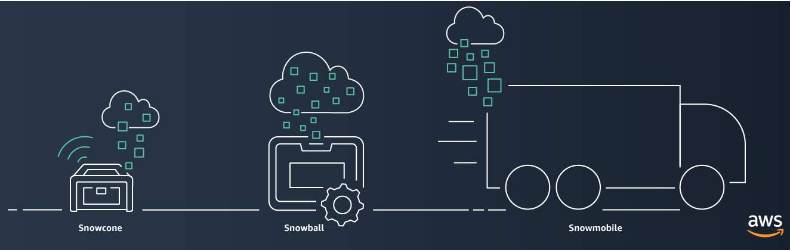
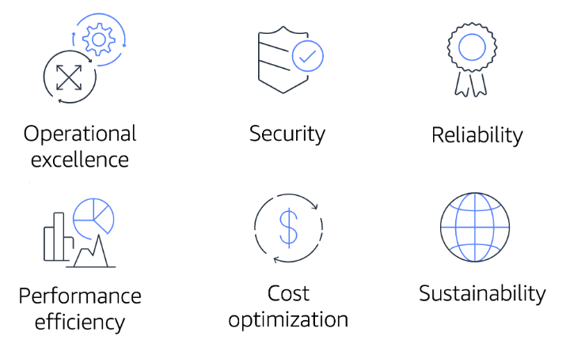

# AWS Cloud Practitioner Essentials

# Module 9: Migration and Innovation

## AWS Cloud Adoption Framework (AWS CAF)

**Six core perspectives of the Cloud Adoption Framework**

At the highest level, the [AWS Cloud Adoption Framework (AWS CAF)](https://d1.awsstatic.com/whitepapers/aws_cloud_adoption_framework.pdf) organizes guidance into six areas of focus, called **Perspectives**. Each Perspective addresses distinct responsibilities. The planning process helps the right people across the organization prepare for the changes ahead.

In general, the **Business**, **People**, and **Governance** Perspectives focus on business capabilities, whereas the **Platform**, **Security**, and **Operations** Perspectives focus on technical capabilities.

**Business Perspective**

The **Business Perspective** ensures that IT aligns with business needs and that IT investments link to key business results.

Use the Business Perspective to create a strong business case for cloud adoption and prioritize cloud adoption initiatives. Ensure that your business strategies and goals align with your IT strategies and goals.

Common roles in the Business Perspective include: 

- Business managers
- Finance managers
- Budget owners
- Strategy stakeholders

**People Perspective**

The **People Perspective** supports development of an organization-wide change management strategy for successful cloud adoption.

Use the People Perspective to evaluate organizational structures and roles, new skill and process requirements, and identify gaps. This helps prioritize training, staffing, and organizational changes.

Common roles in the People Perspective include: 

- Human resources
- Staffing
- People managers

**Governance Perspective**

The **Governance Perspective** focuses on the skills and processes to align IT strategy with business strategy. This ensures that you maximize the business value and minimize risks.

Use the Governance Perspective to understand how to update the staff skills and processes necessary to ensure business governance in the cloud. Manage and measure cloud investments to evaluate business outcomes.

Common roles in the Governance Perspective include: 

- Chief Information Officer (CIO)
- Program managers
- Enterprise architects
- Business analysts
- Portfolio managers

**Platform Perspective**

The **Platform Perspective** includes principles and patterns for implementing new solutions on the cloud, and migrating on-premises workloads to the cloud.

Use a variety of architectural models to understand and communicate the structure of IT systems and their relationships. Describe the architecture of the target state environment in detail.

Common roles in the Platform Perspective include: 

- Chief Technology Officer (CTO)
- IT managers
- Solutions architects

**Security Perspective**

The **Security Perspective** ensures that the organization meets security objectives for visibility, auditability, control, and agility. 

Use the AWS CAF to structure the selection and implementation of security controls that meet the organization’s needs.

Common roles in the Security Perspective include: 

- Chief Information Security Officer (CISO)
- IT security managers
- IT security analysts

**Operations Perspective**

The **Operations Perspective** helps you to enable, run, use, operate, and recover IT workloads to the level agreed upon with your business stakeholders.

Define how day-to-day, quarter-to-quarter, and year-to-year business is conducted. Align with and support the operations of the business. The AWS CAF helps these stakeholders define current operating procedures and identify the process changes and training needed to implement successful cloud adoption.

Common roles in the Operations Perspective include: 

- IT operations managers
- IT support managers

## Test

1. Which Perspective of the AWS Cloud Adoption Framework helps you design, implement, and optimize your AWS infrastructure based on your business goals and perspectives?

R/ Platform Perspective

The Platform Perspective of the AWS Cloud Adoption Framework also includes principles for implementing new solutions and migrating on-premises workloads to the cloud.

The other response options are incorrect because:

- The Business Perspective helps you to move from a model that separates business and IT strategies into a business model that integrates IT strategy.

- The Operations Perspective focuses on operating and recovering IT workloads to meet the requirements of your business stakeholders.

- The People Perspective helps Human Resources (HR) employees prepare their teams for cloud adoption by updating organizational processes and staff skills to include cloud-based competencies.

## Migration Strategies

**6 Strategies for Migration**

When migrating applications to the cloud, six of the most common [migration strategies](https://aws.amazon.com/es/blogs/enterprise-strategy/6-strategies-for-migrating-applications-to-the-cloud/) that you can implement are:

- Rehosting
- Replatforming
- Refactoring/re-architecting
- Repurchasing
- Retaining
- Retiring

**Rehosting**

Rehosting also known as “lift-and-shift” involves moving applications without changes. 

In the scenario of a large legacy migration, in which the company is looking to implement its migration and scale quickly to meet a business case, the majority of applications are rehosted.

**Replatforming**

Replatforming, also known as “lift, tinker, and shift,” involves making a few cloud optimizations to realize a tangible benefit. Optimization is achieved without changing the core architecture of the application.

**Refactoring/re-architecting**

Refactoring (also known as re-architecting) involves reimagining how an application is architected and developed by using cloud-native features. Refactoring is driven by a strong business need to add features, scale, or performance that would otherwise be difficult to achieve in the application’s existing environment.

**Repurchasing**

Repurchasing involves moving from a traditional license to a software-as-a-service model. 

For example, a business might choose to implement the repurchasing strategy by migrating from a customer relationship management (CRM) system to Salesforce.com.

**Retaining**

Retaining consists of keeping applications that are critical for the business in the source environment. This might include applications that require major refactoring before they can be migrated, or, work that can be postponed until a later time.

**Retiring**

Retiring is the process of removing applications that are no longer needed.

## Test

Which migration strategy involves moving to a different product?

- R/ Repurchasing.

Repurchasing involves replacing an existing application with a cloud-based version, such as software found in AWS Marketplace.

## AWS Snow Family

AWS Snow Family Members

The [**AWS Snow Family**](https://aws.amazon.com/es/snow/) is a collection of physical devices that help to physically transport up to exabytes of data into and out of AWS. 

AWS Snow Family is composed of **AWS Snowcone, AWS Snowball**, and **AWS Snowmobile**.

These devices offer different capacity points, and most include built-in computing capabilities. AWS owns and manages the Snow Family devices and integrates with AWS security, monitoring, storage management, and computing capabilities.  

**AWS Snowcone**

[AWS Snowcone](https://aws.amazon.com/es/snowcone/?whats-new-cards.sort-by=item.additionalFields.postDateTime&whats-new-cards.sort-order=desc) is a small, rugged, and secure edge computing and data transfer device. 

It features 2 CPUs, 4 GB of memory, and 8 TB of usable storage.

**AWS Snowball**

[AWS Snowball](https://aws.amazon.com/es/snowball/) offers two types of devices:

**Snowball Edge Storage Optimized** devices are well suited for large-scale data migrations and recurring transfer workflows, in addition to local computing with higher capacity needs. Snowball Edge Storage Optimized provides 80 TB of HDD capacity for block volumes and Amazon S3-compatible object storage, and 1 TB of SATA SSD for block volumes.

**Snowball Edge Compute Optimized** provides powerful computing resources for use cases such as machine learning, full motion video analysis, analytics, and local computing stacks. 

**AWS Snowmobile**

[AWS Snowmobile](https://aws.amazon.com/es/snowmobile/) is an exabyte-scale data transfer service used to move large amounts of data to AWS. 

You can transfer up to 100 petabytes of data per Snowmobile, a 45-foot long ruggedized shipping container, pulled by a semi trailer truck.

## Innovate with AWS

When examining how to use AWS services, it is important to focus on the desired outcomes. You are properly equipped to drive innovation in the cloud if you can clearly articulate the following conditions: 

- The current state
- The desired state
- The problems you are trying to solve

Consider some of the paths you might explore in the future as you continue on your cloud journey. 

**Serverless Applications**

With AWS, **serverless** refers to applications that don’t require you to provision, maintain, or administer servers. You don’t need to worry about fault tolerance or availability. AWS handles these capabilities for you.

AWS Lambda is an example of a service that you can use to run serverless applications. If you design your architecture to trigger Lambda functions to run your code, you can bypass the need to manage a fleet of servers.

Building your architecture with serverless applications enables your developers to focus on their core product instead of managing and operating servers.

**Artificial Intelligence**

AWS offers a variety of services powered by **artificial intelligence (AI)**. 

For example, you can perform the following tasks:

- Convert speech to text with Amazon Transcribe.
- Discover patterns in text with Amazon Comprehend.
- Identify potentially fraudulent online activities with Amazon Fraud Detector.
- Build voice and text chatbots with Amazon Lex.

**Machine Learning**

Traditional **machine learning (ML)** development is complex, expensive, time consuming, and error prone. AWS offers Amazon SageMaker to remove the difficult work from the process and empower you to build, train, and deploy ML models quickly.

You can use ML to analyze data, solve complex problems, and predict outcomes before they happen.

### Test

**Pregunta 1**

Which service enables you to quickly build, train, and deploy machine learning models?

- R/ Amazon SageMaker

Which Perspective of the AWS Cloud Adoption Framework helps you structure the selection and implementation of permissions?

- R/ Security Perspective

Which strategies are included in the six strategies for application migration? Select TWO.

- Retaining, Rehosting

What is the storage capacity of AWS Snowmobile?

- 100 PB

Which statement best describes Amazon Lex?

- A service that enables you to build conversational interfaces using voice and text

## Resources
To learn more about the concepts that were explored in Module 9, review these resources.

- [Migration & Transfer on AWS](https://aws.amazon.com/es/products/migration-and-transfer/)
- [A Process for Mass Migrations to the Cloud](https://aws.amazon.com/es/blogs/enterprise-strategy/214-2/)
- [6 Strategies for Migrating Applications to the Cloud](https://aws.amazon.com/es/blogs/enterprise-strategy/6-strategies-for-migrating-applications-to-the-cloud/)
- [AWS Cloud Adoption Framework](https://aws.amazon.com/es/professional-services/CAF/)
- [AWS Fundamentals: Core Concepts]()
- [AWS Cloud Enterprise Strategy Blog](https://aws.amazon.com/es/blogs/enterprise-strategy/)
- [Modernizing with AWS Blog](https://aws.amazon.com/es/blogs/modernizing-with-aws/)
- [AWS Customer Stories: Data Center Migration](https://aws.amazon.com/es/solutions/case-studies/?customer-references-cards.sort-by=item.additionalFields.publishedDate&customer-references-cards.sort-order=desc&awsf.customer-references-location=*all&awsf.customer-references-segment=*all&awsf.customer-references-product=product%23vpc%7Cproduct%23api-gateway%7Cproduct%23cloudfront%7Cproduct%23route53%7Cproduct%23directconnect%7Cproduct%23elb&awsf.customer-references-category=category%23datacenter-migration)

# Module 10: The cloud journey

## The AWS Well-Architected Framework

The [AWS Well-Architected Framework](https://d1.awsstatic.com/whitepapers/architecture/AWS_Well-Architected_Framework.pdf) helps you understand how to design and operate reliable, secure, efficient, and cost-effective systems in the AWS Cloud. It provides a way for you to consistently measure your architecture against best practices and design principles and identify areas for improvement.

The Well-Architected Framework is based on six pillars: 

- Operational excellence
- Security
- Reliability
- Performance efficiency
- Cost optimization
- Sustainability

**Operational Excellence**

Operational excellence is the ability to run and monitor systems to deliver business value and to continually improve supporting processes and procedures.  

Design principles for operational excellence in the cloud include performing operations as code, annotating documentation, anticipating failure, and frequently making small, reversible changes.

**Security**

The Security pillar is the ability to protect information, systems, and assets while delivering business value through risk assessments and mitigation strategies. 

When considering the security of your architecture, apply these best practices:

- Automate security best practices when possible.
- Apply security at all layers.
- Protect data in transit and at rest.

**Reliability**

Reliability is the ability of a system to do the following:

- Recover from infrastructure or service disruptions
- Dynamically acquire computing resources to meet demand
- Mitigate disruptions such as misconfigurations or transient network issues

Reliability includes testing recovery procedures, scaling horizontally to increase aggregate system availability, and automatically recovering from failure.

**Performance Efficiency**

Performance efficiency is the ability to use computing resources efficiently to meet system requirements and to maintain that efficiency as demand changes and technologies evolve. 

Evaluating the performance efficiency of your architecture includes experimenting more often, using serverless architectures, and designing systems to be able to go global in minutes.

**Cost Optimization**

Cost optimization is the ability to run systems to deliver business value at the lowest price point. 

Cost optimization includes adopting a consumption model, analyzing and attributing expenditure, and using managed services to reduce the cost of ownership.

**Sustainability**

In December 2021, AWS introduced a sustainability pillar as part of the AWS Well-Architected Framework.

Sustainability is the ability to continually improve sustainability impacts by reducing energy consumption and increasing efficiency across all components of a workload by maximizing the benefits from the provisioned resources and minimizing the total resources required.

To facilitate good design for sustainability:

- Understand your impact
- Establish sustainability goals
- Maximize utilization
- Anticipate and adopt new, more efficient hardware and software offerings
- Use managed services
- Reduce the downstream impact of your cloud workloads

## Benefits of the AWS Cloud

Operating in the AWS Cloud offers many benefits over computing in on-premises or hybrid environments. 

In this section, you will learn about six advantages of cloud computing:

- Trade upfront expense for variable expense.
- Benefit from massive economies of scale.
- Stop guessing capacity.
- Increase speed and agility.
- Stop spending money running and maintaining data centers.
- Go global in minutes.

**Trade upfront expense for variable expense.**

Upfront expenses include data centers, physical servers, and other resources that you would need to invest in before using computing resources. 

Instead of investing heavily in data centers and servers before you know how you’re going to use them, you can pay only when you consume computing resources.

**Benefit from massive economies of scale.**

By using cloud computing, you can achieve a lower variable cost than you can get on your own. 

Because usage from hundreds of thousands of customers aggregates in the cloud, providers such as AWS can achieve higher economies of scale. Economies of scale translate into lower pay-as-you-go prices.

**Stop guessing capacity.**

With cloud computing, you don’t have to predict how much infrastructure capacity you will need before deploying an application. 

For example, you can launch Amazon Elastic Compute Cloud (Amazon EC2) instances when needed and pay only for the compute time you use. Instead of paying for resources that are unused or dealing with limited capacity, you can access only the capacity that you need, and scale in or out in response to demand. 

**Increase speed and agility.**

The flexibility of cloud computing makes it easier for you to develop and deploy applications.

This flexibility also provides your development teams with more time to experiment and innovate.

**Stop spending money running and maintaining data centers.**

Cloud computing in data centers often requires you to spend more money and time managing infrastructure and servers. 

A benefit of cloud computing is the ability to focus less on these tasks and more on your applications and customers.

**Go global in minutes.**

The AWS Cloud global footprint enables you to quickly deploy applications to customers around the world, while providing them with low latency.

## Resources

In Module 10, you learned about the following concepts:

**The six pillars of the AWS Well-Architected Framework:**

- Operational excellence
- Security
- Reliability
- Performance efficiency
- Cost optimization
- Sustainability

**Six advantages of cloud computing:**

- Trade upfront expense for variable expense.
- Benefit from massive economies of scale.
- Stop guessing capacity.
- Increase speed and agility.
- Stop spending money running and maintaining data centers.
- Go global in minutes.

**Additional resources**

To learn more about the concepts that were explored in Module 10, review these resources.

- [AWS Well-Architecte](https://aws.amazon.com/es/architecture/well-architected/)
- [AWS Well-Architected Framework](https://docs.aws.amazon.com/wellarchitected/latest/framework/welcome.html)
- [AWS Architecture Center](https://aws.amazon.com/es/architecture/?cards-all.sort-by=item.additionalFields.sortDate&cards-all.sort-order=desc&awsf.content-type=*all&awsf.methodology=*all&awsf.tech-category=*all&awsf.industries=*all&awsf.business-category=*all)
- [Six Advantages of Cloud Computing](https://docs.aws.amazon.com/whitepapers/latest/aws-overview/six-advantages-of-cloud-computing.html)
- [AWS Architecture Blog](https://aws.amazon.com/es/blogs/architecture/)